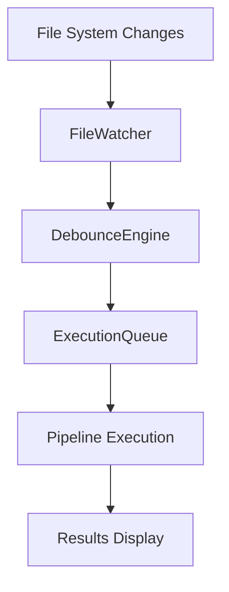

# Watch Mode

Watch Mode enables automatic re-execution of pipelines when source files change. This creates a rapid feedback loop for local development, automatically running your pipeline whenever you save changes.

## Quick Start

```bash
# Watch and run pipeline on file changes
pdk run --watch

# Watch with specific step filtering
pdk run --watch --step-filter "Build"

# Watch with verbose logging
pdk run --watch --verbose
```

## CLI Options

| Option | Description | Default |
|--------|-------------|---------|
| `--watch`, `-w` | Enable watch mode | false |
| `--watch-debounce <ms>` | Debounce delay in milliseconds | 500 |
| `--watch-clear` | Clear terminal between runs | false |

## How It Works

1. **File Detection**: PDK monitors your project directory for file changes
2. **Debouncing**: Multiple rapid changes are aggregated to prevent redundant executions
3. **Sequential Execution**: Pipeline runs are queued and executed one at a time
4. **Statistics Tracking**: Success/failure rates are tracked across runs

### Architecture



## Debouncing

Debouncing prevents multiple pipeline runs when you save multiple files in quick succession (e.g., when your editor saves multiple files at once).

```bash
# Use 500ms debounce window
pdk run --watch --watch-debounce 500
```

Default debounce is 500ms. All file changes within this window are aggregated into a single pipeline run.

## Combining with Other Features

### With Step Filtering

Run only specific steps on each file change:

```bash
# Only run Build step on changes
pdk run --watch --step-filter "Build"

# Skip slow steps during development
pdk run --watch --skip-step "Deploy" --skip-step "Integration Tests"
```

### With Verbose Logging

Get detailed output during development:

```bash
# Debug level logging
pdk run --watch --verbose

# Trace level for maximum detail
pdk run --watch --trace
```

## UI Indicators

During watch mode, the CLI shows:

- Current state (Watching, Debouncing, Executing)
- Number of pending changes
- Run statistics (success/failure counts, success rate)
- Timestamp of last run

## Stopping Watch Mode

Press `Ctrl+C` to stop watch mode. PDK will:

1. Cancel any running execution
2. Display final statistics
3. Exit cleanly

## Mutual Exclusions

Watch mode cannot be combined with:

- `--dry-run`: These modes are mutually exclusive
- `--interactive`: Cannot use interactive mode with watch

## Troubleshooting

### Changes Not Detected

1. Check your include patterns match the files being changed
2. Verify files aren't in an excluded directory
3. Ensure you have read permissions on the watched directories

### Too Many Executions

Increase the debounce delay:

```bash
pdk run --watch --watch-debounce 1000
```

### High CPU Usage

Exclude large directories or binary files using configuration:

```json
{
  "watch": {
    "excludePatterns": ["node_modules/**", "**/*.exe", "dist/**"]
  }
}
```

## Example Workflow

A typical development workflow with watch mode:

```bash
# Terminal 1: Start watch mode with filtering
pdk run --watch --step-filter "Build" --step-filter "Test" --verbose

# Terminal 2: Edit source files
# Watch mode automatically rebuilds and tests on save

# When ready for full pipeline
# Press Ctrl+C to stop watch mode
pdk run  # Run full pipeline
```

## Configuration

Watch mode settings can be configured in `.pdkrc` or `pdk.config.json`:

```json
{
  "watch": {
    "debounceMs": 500,
    "clearOnRerun": false,
    "excludePatterns": ["node_modules/**", "dist/**", ".git/**"]
  }
}
```

## Best Practices

1. **Use step filtering**: Focus on the steps you're actively developing
2. **Increase debounce for slow pipelines**: Prevents queueing multiple runs
3. **Combine with verbose logging**: Get immediate feedback on issues
4. **Exclude generated files**: Prevent infinite loops from build outputs

## See Also

- [pdk run Command](../commands/run.md)
- [Step Filtering](filtering.md)
- [Logging](logging.md)
