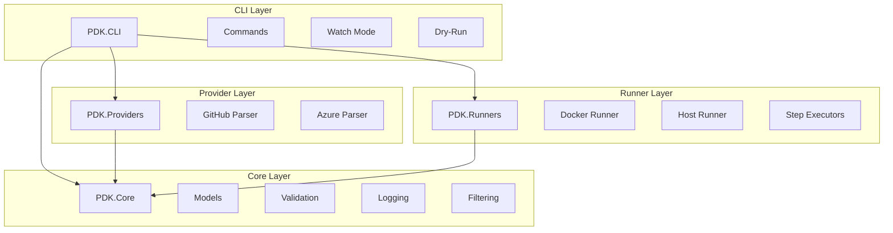
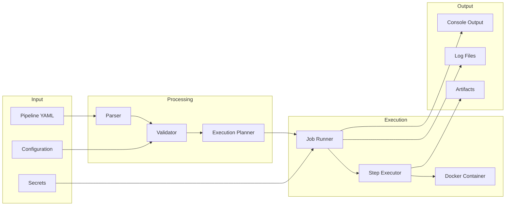

# PDK Architecture

This section documents PDK's internal architecture, design patterns, and component interactions.

## Architecture Overview

PDK is organized into distinct layers, each with clear responsibilities:

## Layer Responsibilities

| Layer | Project | Responsibility |
|-------|---------|----------------|
| CLI | `PDK.CLI` | User interface, commands, options |
| Core | `PDK.Core` | Models, validation, logging, filtering |
| Provider | `PDK.Providers` | Pipeline parsing (GitHub, Azure) |
| Runner | `PDK.Runners` | Step execution (Docker, Host) |

## Architecture Documents

| Document | Description |
|----------|-------------|
| [System Overview](system-overview.md) | High-level architecture and technology stack |
| [Parser Architecture](parsers.md) | How pipeline files are parsed |
| [Runner Architecture](runners.md) | How steps are executed |
| [CLI Architecture](cli.md) | Command-line interface structure |
| [Configuration](configuration.md) | Configuration system design |
| [Logging](logging.md) | Structured logging architecture |
| [Data Flow](data-flow.md) | How data flows through the system |

## Key Design Principles

### 1. Provider Agnostic Core

The core execution engine works with a common pipeline model, not provider-specific formats. This enables:
- Single execution code path
- Easy addition of new providers
- Consistent behavior across platforms

### 2. Extensibility Through Interfaces

Key extension points use interfaces:
- `IPipelineParser` - Add new CI/CD platforms
- `IStepExecutor` - Add new step types
- `IJobRunner` - Add new execution modes
- `IValidationPhase` - Add validation rules

### 3. Fail-Fast with Clear Errors

PDK validates early and provides actionable error messages:
- YAML validation on parse
- Executor availability check
- Variable resolution validation
- Dependency graph validation

### 4. Security by Default

- Secrets masked in all output
- Docker isolation for step execution
- No arbitrary code from external sources

## Component Diagram

## Technology Stack

### Core Framework
- **.NET 8.0** - Runtime and framework
- **C# 12** - Language with modern features

### CLI
- **System.CommandLine** - Command-line parsing
- **Spectre.Console** - Terminal UI and formatting

### Parsing
- **YamlDotNet** - YAML deserialization

### Execution
- **Docker.DotNet** - Docker API integration
- **Process execution** - Host mode commands

### Testing
- **xUnit** - Test framework
- **FluentAssertions** - Assertion library
- **Moq** - Mocking framework
- **BenchmarkDotNet** - Performance benchmarks

## Next Steps

Start with [System Overview](system-overview.md) for a detailed look at the architecture, or jump to a specific area:

- [Parser Architecture](parsers.md) - Understanding how pipelines are parsed
- [Runner Architecture](runners.md) - How steps are executed
- [Extension Guide](../extending/README.md) - Adding new capabilities
