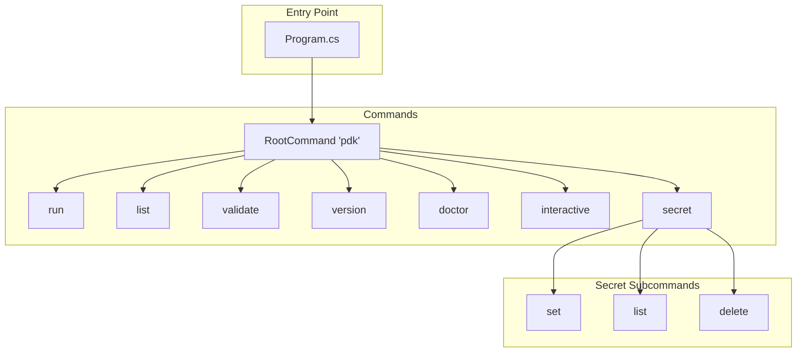

# CLI Architecture

This document describes PDK's command-line interface structure using System.CommandLine.

## Overview

PDK uses [System.CommandLine](https://github.com/dotnet/command-line-api) for CLI parsing and command handling.



## Command Structure

### Root Command

```csharp
var rootCommand = new RootCommand("PDK - Pipeline Development Kit");

rootCommand.AddCommand(runCommand);
rootCommand.AddCommand(listCommand);
rootCommand.AddCommand(validateCommand);
rootCommand.AddCommand(versionCommand);
rootCommand.AddCommand(doctorCommand);
rootCommand.AddCommand(interactiveCommand);
rootCommand.AddCommand(secretCommand);
```

### Command Hierarchy

| Command | Description | Key Options |
|---------|-------------|-------------|
| `pdk run` | Execute pipeline | `--file`, `--job`, `--watch`, `--dry-run` |
| `pdk list` | List jobs/steps | `--file`, `--details`, `--format` |
| `pdk validate` | Validate pipeline | `--file` |
| `pdk version` | Show version | `--full`, `--format` |
| `pdk doctor` | System diagnostics | - |
| `pdk interactive` | Interactive mode | `--file` |
| `pdk secret` | Manage secrets | Subcommands: `set`, `list`, `delete` |

## Run Command Options

The run command has extensive options organized by feature:

### Basic Options

```csharp
var fileOption = new Option<FileInfo>(
    aliases: ["--file", "-f"],
    description: "Path to the pipeline file")
{ IsRequired = true };

var jobOption = new Option<string?>(
    aliases: ["--job", "-j"],
    description: "Specific job to run");

var hostOption = new Option<bool>(
    aliases: ["--host"],
    description: "Run on host machine instead of Docker");
```

### Logging Options

```csharp
var verboseOption = new Option<bool>(
    aliases: ["--verbose", "-v"],
    description: "Enable verbose logging");

var traceOption = new Option<bool>(
    aliases: ["--trace"],
    description: "Enable trace-level logging");

var quietOption = new Option<bool>(
    aliases: ["--quiet", "-q"],
    description: "Suppress step output");

var silentOption = new Option<bool>(
    aliases: ["--silent"],
    description: "Show only errors");

var logFileOption = new Option<string?>(
    aliases: ["--log-file"],
    description: "Path to write log file");
```

### Watch Mode Options

```csharp
var watchOption = new Option<bool>(
    aliases: ["--watch", "-w"],
    description: "Watch for file changes and re-execute");

var watchDebounceOption = new Option<int>(
    aliases: ["--watch-debounce"],
    description: "Debounce period in milliseconds",
    getDefaultValue: () => 500);
```

### Filtering Options

```csharp
var filterStepOption = new Option<string[]>(
    aliases: ["--step-filter"],
    description: "Run specific steps by name")
{ AllowMultipleArgumentsPerToken = true };

var skipStepOption = new Option<string[]>(
    aliases: ["--skip-step"],
    description: "Skip specific steps");
```

## Option Validation

System.CommandLine supports custom validators:

```csharp
fileOption.AddValidator(result =>
{
    var file = result.GetValueForOption(fileOption);
    if (file?.Exists == false)
    {
        result.ErrorMessage = $"File not found: {file.FullName}";
    }
});

runnerOption.AddValidator(result =>
{
    var value = result.GetValueForOption(runnerOption);
    if (value != null && value != "docker" && value != "host" && value != "auto")
    {
        result.ErrorMessage = "Runner must be 'docker', 'host', or 'auto'";
    }
});
```

## Command Handlers

### Inline Handler

```csharp
runCommand.SetHandler(async context =>
{
    var file = context.ParseResult.GetValueForOption(fileOption)!;
    var verbose = context.ParseResult.GetValueForOption(verboseOption);

    // ... command logic
});
```

### Command Class

For complex commands, use a dedicated class:

```csharp
public class ListCommand
{
    public FileInfo? File { get; set; }
    public bool Details { get; set; }
    public OutputFormat Format { get; set; }

    public async Task<int> ExecuteAsync()
    {
        // Implementation
    }
}

// Registration
listCommand.SetHandler(async (file, details, format) =>
{
    var cmd = serviceProvider.GetRequiredService<ListCommand>();
    cmd.File = file;
    cmd.Details = details;
    cmd.Format = format;
    Environment.ExitCode = await cmd.ExecuteAsync();
}, listFileOption, detailsOption, formatOption);
```

## Dependency Injection

PDK configures DI in `Program.cs`:

```csharp
var services = new ServiceCollection();
ConfigureServices(services);
var serviceProvider = services.BuildServiceProvider();

static void ConfigureServices(ServiceCollection services)
{
    // Logging
    services.AddLogging(builder => builder.ConfigurePdkLogging());

    // UI
    services.AddSingleton<IAnsiConsole>(AnsiConsole.Console);
    services.AddSingleton<IConsoleOutput, ConsoleOutput>();

    // Parsers
    services.AddSingleton<IPipelineParser, GitHubActionsParser>();
    services.AddSingleton<IPipelineParser, AzureDevOpsParser>();
    services.AddSingleton<PipelineParserFactory>();

    // Runners
    services.AddSingleton<DockerJobRunner>();
    services.AddSingleton<HostJobRunner>();
    services.AddSingleton<IRunnerFactory, RunnerFactory>();

    // Step Executors
    services.AddSingleton<IStepExecutor, ScriptStepExecutor>();
    services.AddSingleton<IStepExecutor, DotnetStepExecutor>();
    services.AddSingleton<StepExecutorFactory>();

    // Commands
    services.AddTransient<ListCommand>();
    services.AddTransient<VersionCommand>();
    services.AddTransient<InteractiveCommand>();
}
```

## Error Handling

### Error Formatter

```csharp
public class ErrorFormatter
{
    private readonly IAnsiConsole _console;
    private readonly ISecretMasker _secretMasker;

    public void DisplayError(Exception ex, bool verbose)
    {
        var message = _secretMasker.Mask(ex.Message);
        _console.MarkupLine($"[red]Error:[/] {message}");

        if (verbose && ex.StackTrace != null)
        {
            _console.MarkupLine($"[dim]{ex.StackTrace}[/]");
        }
    }
}
```

### Exit Codes

| Code | Meaning |
|------|---------|
| 0 | Success |
| 1 | General error |
| 2 | Command-line syntax error |

```csharp
try
{
    await executor.Execute(options);
}
catch (Exception ex)
{
    errorFormatter.DisplayError(ex, verbose);
    Environment.Exit(1);
}
```

## Console Output

PDK uses Spectre.Console for rich terminal output:

```csharp
public class ConsoleOutput : IConsoleOutput
{
    private readonly IAnsiConsole _console;

    public void WriteSuccess(string message)
    {
        _console.MarkupLine($"[green]✓[/] {message}");
    }

    public void WriteError(string message)
    {
        _console.MarkupLine($"[red]✗[/] {message}");
    }

    public void WriteWarning(string message)
    {
        _console.MarkupLine($"[yellow]![/] {message}");
    }
}
```

### Tables

```csharp
var table = new Table();
table.AddColumn("Job");
table.AddColumn("Steps");
table.AddColumn("Status");

foreach (var job in pipeline.Jobs.Values)
{
    table.AddRow(job.Name, job.Steps.Count.ToString(), "Pending");
}

AnsiConsole.Write(table);
```

### Progress

```csharp
await AnsiConsole.Status()
    .Spinner(Spinner.Known.Dots)
    .StartAsync("Building...", async ctx =>
    {
        ctx.Status("Running tests...");
        await RunTestsAsync();

        ctx.Status("Complete");
    });
```

## Watch Mode Integration

Watch mode is integrated into the run command:

```csharp
if (watch)
{
    var watchService = serviceProvider.GetRequiredService<IWatchModeService>();

    using var cts = new CancellationTokenSource();
    Console.CancelKeyPress += (_, e) =>
    {
        e.Cancel = true;
        cts.Cancel();
    };

    await using (watchService)
    {
        await watchService.RunAsync(executionOptions, watchModeOptions, cts.Token);
    }
    return;
}
```

## Subcommand Pattern

The secret command uses subcommands:

```csharp
var secretCommand = new Command("secret", "Manage secrets");

var secretSetCommand = new Command("set", "Set a secret value");
secretSetCommand.AddArgument(new Argument<string>("name", "Secret name"));
secretSetCommand.AddOption(new Option<string?>("--value", "Secret value"));

var secretListCommand = new Command("list", "List secret names");

var secretDeleteCommand = new Command("delete", "Delete a secret");
secretDeleteCommand.AddArgument(new Argument<string>("name", "Secret to delete"));

secretCommand.AddCommand(secretSetCommand);
secretCommand.AddCommand(secretListCommand);
secretCommand.AddCommand(secretDeleteCommand);
```

## Adding a New Command

1. **Define the command and options**:
```csharp
var myCommand = new Command("mycommand", "Description");
myCommand.AddOption(new Option<string>("--option", "Description"));
```

2. **Set the handler**:
```csharp
myCommand.SetHandler(async (option) =>
{
    // Implementation
}, optionBinder);
```

3. **Add to root command**:
```csharp
rootCommand.AddCommand(myCommand);
```

4. **For complex commands, create a class**:
```csharp
public class MyCommand
{
    public string? Option { get; set; }
    public async Task<int> ExecuteAsync() { }
}

services.AddTransient<MyCommand>();
```

## Next Steps

- [Configuration](configuration.md) - Configuration system
- [Logging](logging.md) - Structured logging
- [Data Flow](data-flow.md) - Complete execution flow
