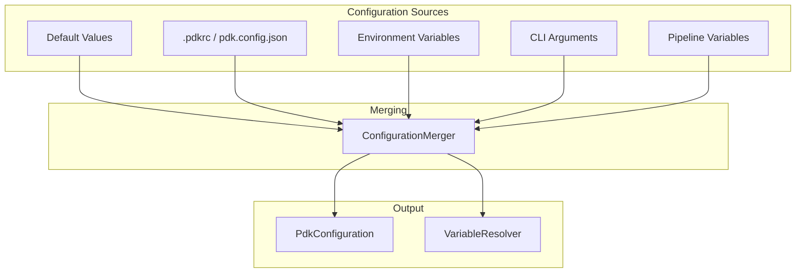
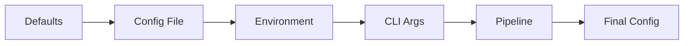

# Configuration Architecture

This document describes PDK's configuration system, including file formats, merging, and variable resolution.

## Overview

PDK uses a hierarchical configuration system that supports:
- Configuration files (`.pdkrc`, `pdk.config.json`)
- Environment variables
- CLI arguments
- Pipeline-defined variables



## Configuration Files

### Supported Formats

| File | Format | Location |
|------|--------|----------|
| `.pdkrc` | YAML | Project root or user home |
| `pdk.config.json` | JSON | Project root |

### YAML Configuration (.pdkrc)

```yaml
# Runner configuration
runner:
  type: auto  # docker, host, or auto
  timeout: 3600  # seconds

# Watch mode settings
watch:
  debounce: 500  # milliseconds
  include:
    - "**/*.cs"
    - "**/*.yml"
  exclude:
    - "**/bin/**"
    - "**/obj/**"
    - "**/node_modules/**"

# Logging settings
logging:
  level: information  # trace, debug, information, warning, error
  file: logs/pdk.log
  format: text  # text or json

# Variable definitions
variables:
  DOTNET_VERSION: "8.0"
  BUILD_CONFIGURATION: Release

# Step filtering presets
presets:
  quick:
    steps: ["build"]
    skipSteps: ["test"]
  full:
    steps: []  # all steps
```

### JSON Configuration (pdk.config.json)

```json
{
  "runner": {
    "type": "auto",
    "timeout": 3600
  },
  "watch": {
    "debounce": 500,
    "include": ["**/*.cs", "**/*.yml"],
    "exclude": ["**/bin/**", "**/obj/**"]
  },
  "logging": {
    "level": "information",
    "file": "logs/pdk.log"
  },
  "variables": {
    "DOTNET_VERSION": "8.0",
    "BUILD_CONFIGURATION": "Release"
  }
}
```

## Configuration Loading

### IConfigurationLoader

```csharp
public interface IConfigurationLoader
{
    /// <summary>
    /// Loads configuration from specified path or auto-discovers.
    /// </summary>
    Task<PdkConfiguration?> LoadAsync(string? configPath = null);
}
```

### Auto-Discovery

The loader searches for configuration files in order:

1. Specified path (if provided)
2. Current directory: `.pdkrc`, `pdk.config.json`
3. Parent directories (up to repository root)
4. User home directory: `~/.pdkrc`

```csharp
public class ConfigurationLoader : IConfigurationLoader
{
    private static readonly string[] ConfigFileNames = [
        ".pdkrc",
        "pdk.config.json"
    ];

    public async Task<PdkConfiguration?> LoadAsync(string? configPath)
    {
        var path = configPath ?? DiscoverConfigFile();
        if (path == null) return null;

        return await ParseConfigFileAsync(path);
    }

    private string? DiscoverConfigFile()
    {
        var current = Directory.GetCurrentDirectory();
        while (current != null)
        {
            foreach (var name in ConfigFileNames)
            {
                var path = Path.Combine(current, name);
                if (File.Exists(path)) return path;
            }
            current = Directory.GetParent(current)?.FullName;
        }
        return null;
    }
}
```

## Configuration Model

```csharp
public class PdkConfiguration
{
    public RunnerConfiguration Runner { get; set; } = new();
    public WatchConfiguration Watch { get; set; } = new();
    public LoggingConfiguration Logging { get; set; } = new();
    public Dictionary<string, string> Variables { get; set; } = new();
    public Dictionary<string, PresetConfiguration> Presets { get; set; } = new();
}

public class RunnerConfiguration
{
    public string Type { get; set; } = "auto";
    public int Timeout { get; set; } = 3600;
}

public class WatchConfiguration
{
    public int Debounce { get; set; } = 500;
    public List<string> Include { get; set; } = new();
    public List<string> Exclude { get; set; } = new();
}

public class LoggingConfiguration
{
    public string Level { get; set; } = "information";
    public string? File { get; set; }
    public string Format { get; set; } = "text";
}
```

## Configuration Merging

### IConfigurationMerger

```csharp
public interface IConfigurationMerger
{
    /// <summary>
    /// Merges configurations with later sources taking precedence.
    /// </summary>
    PdkConfiguration Merge(params PdkConfiguration?[] configs);
}
```

### Merge Order (Later Wins)



### Merge Implementation

```csharp
public class ConfigurationMerger : IConfigurationMerger
{
    public PdkConfiguration Merge(params PdkConfiguration?[] configs)
    {
        var result = new PdkConfiguration();

        foreach (var config in configs.Where(c => c != null))
        {
            // Merge runner settings
            if (config.Runner.Type != "auto")
                result.Runner.Type = config.Runner.Type;

            // Merge watch settings
            if (config.Watch.Debounce != 500)
                result.Watch.Debounce = config.Watch.Debounce;

            // Merge collections (combine, don't replace)
            result.Watch.Include.AddRange(config.Watch.Include);
            result.Watch.Exclude.AddRange(config.Watch.Exclude);

            // Merge variables (later wins)
            foreach (var (key, value) in config.Variables)
                result.Variables[key] = value;
        }

        return result;
    }
}
```

## Variable Resolution

### Variable Sources

| Source | Priority | Example |
|--------|----------|---------|
| Built-in | Lowest | `${WORKSPACE}`, `${JOB_NAME}` |
| Config file | Low | `variables:` in .pdkrc |
| Environment | Medium | `PDK_VAR_*` or any env var |
| CLI | High | `--var NAME=VALUE` |
| Pipeline | Highest | `env:` in workflow |

### IVariableResolver

```csharp
public interface IVariableResolver
{
    /// <summary>
    /// Gets a variable value.
    /// </summary>
    string? GetVariable(string name);

    /// <summary>
    /// Sets a variable with specified source.
    /// </summary>
    void SetVariable(string name, string value, VariableSource source);

    /// <summary>
    /// Loads variables from configuration.
    /// </summary>
    void LoadFromConfiguration(PdkConfiguration config);

    /// <summary>
    /// Loads variables from environment.
    /// </summary>
    void LoadFromEnvironment();
}
```

### Variable Expansion

```csharp
public interface IVariableExpander
{
    /// <summary>
    /// Expands ${VAR_NAME} references in a string.
    /// </summary>
    string Expand(string template);
}
```

Example:
```csharp
var expander = new VariableExpander(resolver);
var result = expander.Expand("Building ${PROJECT_NAME} in ${BUILD_CONFIGURATION}");
// Result: "Building MyApp in Release"
```

### Built-in Variables

| Variable | Description |
|----------|-------------|
| `${WORKSPACE}` | Workspace root directory |
| `${JOB_NAME}` | Current job name |
| `${STEP_NAME}` | Current step name |
| `${RUNNER}` | Runner type (docker/host) |
| `${PDK_HOST_MODE}` | "true" if running in host mode |

## Secret Management

### Secret Storage

Secrets are stored securely using platform encryption:

```csharp
public interface ISecretManager
{
    Task SetSecretAsync(string name, string value);
    Task<string?> GetSecretAsync(string name);
    Task<bool> SecretExistsAsync(string name);
    Task DeleteSecretAsync(string name);
    Task<IEnumerable<string>> ListSecretNamesAsync();
}
```

### Secret Sources

| Source | Priority | Notes |
|--------|----------|-------|
| Stored secrets | Medium | `pdk secret set NAME` |
| Environment | High | `PDK_SECRET_NAME` |
| CLI | Highest | `--secret NAME=VALUE` (visible in process list!) |

### Secret Masking

All secrets are automatically masked in output:

```csharp
public interface ISecretMasker
{
    void RegisterSecret(string secret);
    string Mask(string text);
}
```

## Configuration Validation

```csharp
public class ConfigurationValidator
{
    public ValidationResult Validate(PdkConfiguration config)
    {
        var errors = new List<string>();

        if (config.Watch.Debounce < 100)
            errors.Add("Watch debounce must be at least 100ms");

        if (config.Watch.Debounce > 10000)
            errors.Add("Watch debounce must be at most 10000ms");

        if (config.Runner.Timeout < 0)
            errors.Add("Runner timeout cannot be negative");

        return new ValidationResult(errors.Count == 0, errors);
    }
}
```

## Environment Variable Mapping

PDK maps environment variables to configuration:

| Environment Variable | Configuration |
|---------------------|---------------|
| `PDK_LOG_LEVEL` | `logging.level` |
| `PDK_DEBOUNCE_MS` | `watch.debounce` |
| `PDK_RUNNER` | `runner.type` |
| `PDK_NO_REDACT` | Disable secret masking |
| `PDK_VAR_*` | Variable values |
| `PDK_SECRET_*` | Secret values |

## Next Steps

- [Logging Architecture](logging.md) - Structured logging
- [Data Flow](data-flow.md) - Configuration in execution flow
- [Variables Guide](../../configuration/variables.md) - User guide
