# Data Flow

This document describes how data flows through PDK from pipeline file to execution results.

## Normal Execution Flow

The complete flow from `pdk run` to completion:

## Phase Details

### 1. Input Phase

**Inputs:**
- Pipeline file path
- CLI options (`--verbose`, `--host`, etc.)
- CLI variables (`--var NAME=VALUE`)
- CLI secrets (`--secret NAME=VALUE`)
- Configuration file (`.pdkrc`)
- Environment variables

### 2. Parse Phase

**Outputs:**
- Common Pipeline model
- Jobs with steps
- Environment variables
- Job dependencies

### 3. Prepare Phase

**Outputs:**
- Validated pipeline
- Resolved variables
- Filtered step list

### 4. Plan Phase

**Outputs:**
- Ordered list of jobs
- Dependency resolution
- Execution context per job

### 5. Execute Phase

**Outputs:**
- Step execution results
- Job execution results
- Container outputs

### 6. Output Phase

**Outputs:**
- Console display (step status, output)
- Log files (text and/or JSON)
- Artifacts (if any)
- Exit code

## Watch Mode Flow

### Watch Mode Components

| Component | Purpose |
|-----------|---------|
| `FileWatcher` | Monitors file system for changes |
| `DebounceEngine` | Aggregates rapid changes (default 500ms) |
| `ExecutionQueue` | Ensures sequential execution |
| `WatchModeStatistics` | Tracks success/failure counts |

## Dry-Run Flow

### Dry-Run Validation Phases

| Phase | Checks |
|-------|--------|
| Schema | YAML structure, required fields |
| Executor | Step executors available |
| Variable | Variable references resolvable |
| Dependency | No circular dependencies |

## Step Filtering Flow

### Filter Precedence

1. **Skip filters** (highest priority)
2. **Include filters** (step name, step index)
3. **Job filters**
4. **Defaults** (include all)

## Error Flow

```mermaid
flowchart TB
    Error[Error Occurs]
    Classify{Error Type}

    Parse[Parse Error]
    Validation[Validation Error]
    Execution[Execution Error]
    System[System Error]

    ParseHandler[Show YAML location]
    ValidationHandler[Show validation messages]
    ExecutionHandler[Show step output + exit code]
    SystemHandler[Show error + stack trace]

    Mask[Mask Secrets]
    Display[Display to User]
    LogFile[Write to Log]
    Exit[Exit with code 1]

    Error --> Classify
    Classify -->|Parse| Parse
    Classify -->|Validation| Validation
    Classify -->|Execution| Execution
    Classify -->|System| System

    Parse --> ParseHandler
    Validation --> ValidationHandler
    Execution --> ExecutionHandler
    System --> SystemHandler

    ParseHandler --> Mask
    ValidationHandler --> Mask
    ExecutionHandler --> Mask
    SystemHandler --> Mask

    Mask --> Display
    Mask --> LogFile
    Display --> Exit
```

## Data Models Through the Flow

## Next Steps

- [System Overview](system-overview.md) - Architecture overview
- [Runner Architecture](runners.md) - Execution details
- [Logging Architecture](logging.md) - Logging in the flow
