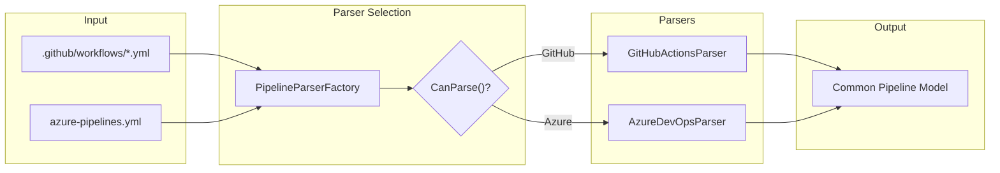
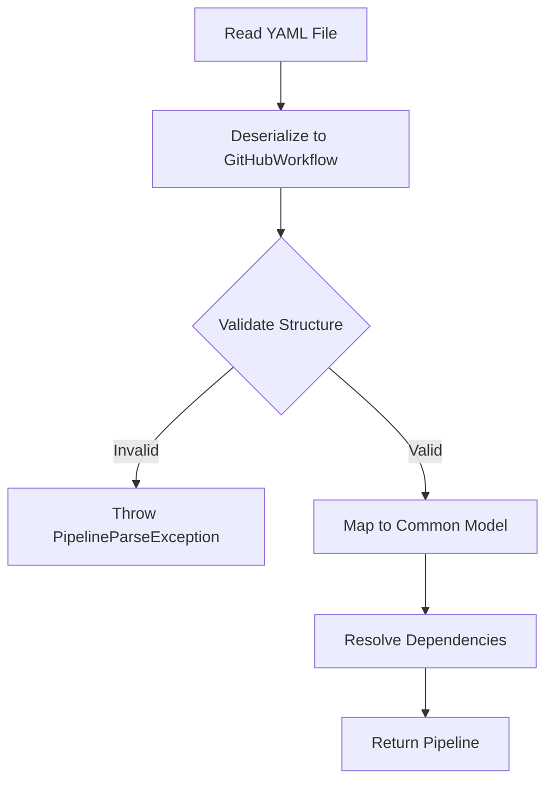
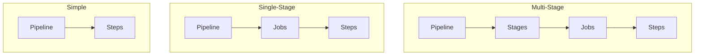

# Parser Architecture

This document describes how PDK parses CI/CD pipeline files from different providers into a common model.

## Overview

The parser layer transforms provider-specific YAML formats (GitHub Actions, Azure DevOps) into PDK's common pipeline model.



## Core Interfaces

### IPipelineParser

```csharp
public interface IPipelineParser
{
    /// <summary>
    /// Parses YAML content into a pipeline.
    /// </summary>
    Pipeline Parse(string yamlContent);

    /// <summary>
    /// Parses a pipeline file.
    /// </summary>
    Task<Pipeline> ParseFile(string filePath);

    /// <summary>
    /// Determines if this parser can handle the given file.
    /// </summary>
    bool CanParse(string filePath);
}
```

### IPipelineParserFactory

```csharp
public interface IPipelineParserFactory
{
    /// <summary>
    /// Gets the appropriate parser for the given file.
    /// </summary>
    IPipelineParser GetParser(string filePath);
}
```

## Parser Factory

The factory selects the correct parser based on file characteristics:

```csharp
public class PipelineParserFactory : IPipelineParserFactory
{
    private readonly IEnumerable<IPipelineParser> _parsers;

    public IPipelineParser GetParser(string filePath)
    {
        // Find first parser that can handle this file
        var parser = _parsers.FirstOrDefault(p => p.CanParse(filePath));

        if (parser == null)
            throw new NotSupportedException($"No parser for: {filePath}");

        return parser;
    }
}
```

### Detection Logic

| Parser | Detection Criteria |
|--------|-------------------|
| GitHub Actions | Path contains `.github/workflows`, has `jobs:` section, jobs have `runs-on` |
| Azure DevOps | File has `pool:`, `stages:`, or `task:` sections |

## GitHub Actions Parser

Location: `src/PDK.Providers/GitHub/GitHubActionsParser.cs`

### Parsing Flow



### Provider-Specific Models

```csharp
public class GitHubWorkflow
{
    public string? Name { get; set; }
    public Dictionary<string, GitHubJob>? Jobs { get; set; }
    public Dictionary<string, string>? Env { get; set; }
}

public class GitHubJob
{
    [YamlMember(Alias = "runs-on")]
    public string? RunsOn { get; set; }

    public List<string>? Needs { get; set; }
    public List<GitHubStep>? Steps { get; set; }
    public Dictionary<string, string>? Env { get; set; }
}

public class GitHubStep
{
    public string? Name { get; set; }
    public string? Uses { get; set; }  // Action reference
    public string? Run { get; set; }   // Script content
    public string? Shell { get; set; }
    public Dictionary<string, string>? With { get; set; }
    public Dictionary<string, string>? Env { get; set; }
}
```

### Action Mapping

The `ActionMapper` converts GitHub Actions to PDK step types:

```csharp
public StepType MapAction(string uses)
{
    // actions/checkout@v4 → StepType.Checkout
    // actions/setup-dotnet@v4 → StepType.Dotnet (setup)
    // actions/upload-artifact@v4 → StepType.UploadArtifact

    return uses switch
    {
        var u when u.StartsWith("actions/checkout") => StepType.Checkout,
        var u when u.StartsWith("actions/upload-artifact") => StepType.UploadArtifact,
        var u when u.StartsWith("actions/download-artifact") => StepType.DownloadArtifact,
        _ => StepType.Unknown
    };
}
```

### Validation

The parser validates:
- At least one job exists
- Each job has `runs-on` specified
- Each step has either `uses` or `run` (not both)
- No circular dependencies between jobs

## Azure DevOps Parser

Location: `src/PDK.Providers/AzureDevOps/AzureDevOpsParser.cs`

### Pipeline Hierarchy

Azure DevOps supports multiple hierarchy patterns:



### Provider-Specific Models

```csharp
public class AzurePipeline
{
    public string? Name { get; set; }
    public AzurePool? Pool { get; set; }
    public List<AzureStage>? Stages { get; set; }
    public List<AzureJob>? Jobs { get; set; }
    public List<AzureStep>? Steps { get; set; }
    public Dictionary<string, string>? Variables { get; set; }
}

public class AzurePool
{
    public string? VmImage { get; set; }  // Microsoft-hosted
    public string? Name { get; set; }      // Self-hosted
}

public class AzureStep
{
    public string? Task { get; set; }      // Task@version format
    public string? Script { get; set; }
    public string? Bash { get; set; }
    public string? Pwsh { get; set; }
    public string? Checkout { get; set; }
    public Dictionary<string, string>? Inputs { get; set; }
}
```

### Task Mapping

The `AzureStepMapper` converts Azure tasks to PDK step types:

```csharp
public StepType MapTask(string task)
{
    // DotNetCoreCLI@2 → StepType.Dotnet
    // PowerShell@2 → StepType.PowerShell
    // Bash@3 → StepType.Script

    var taskName = task.Split('@')[0];
    return taskName switch
    {
        "DotNetCoreCLI" => StepType.Dotnet,
        "PowerShell" => StepType.PowerShell,
        "Bash" => StepType.Script,
        "Docker" => StepType.Docker,
        _ => StepType.Unknown
    };
}
```

### Hierarchy Flattening

Multi-stage pipelines are flattened to jobs:

```csharp
// Stage "build" with job "compile" becomes job "build_compile"
var jobId = $"{stage.Name}_{job.Name}";
```

### Variable Syntax Conversion

Azure DevOps uses `$(variable)` syntax, converted to `${variable}`:

```csharp
private string ConvertVariableSyntax(string value)
{
    // $(VAR_NAME) → ${VAR_NAME}
    return Regex.Replace(value, @"\$\(([^)]+)\)", "${$1}");
}
```

## Common Pipeline Model

Both parsers produce the same output:

```csharp
public class Pipeline
{
    public string Name { get; set; }
    public Dictionary<string, Job> Jobs { get; set; }
    public Dictionary<string, string> Variables { get; set; }
    public PipelineProvider Provider { get; set; }
}

public class Job
{
    public string Id { get; set; }
    public string Name { get; set; }
    public string RunsOn { get; set; }
    public List<Step> Steps { get; set; }
    public List<string> DependsOn { get; set; }
    public Dictionary<string, string> Environment { get; set; }
}

public class Step
{
    public string? Id { get; set; }
    public string Name { get; set; }
    public StepType Type { get; set; }
    public string? Script { get; set; }
    public string Shell { get; set; }
    public Dictionary<string, string> With { get; set; }
    public Dictionary<string, string> Environment { get; set; }
    public bool ContinueOnError { get; set; }
}
```

## Error Handling

Parsers provide detailed error messages:

```csharp
try
{
    var workflow = deserializer.Deserialize<GitHubWorkflow>(yaml);
}
catch (YamlException ex)
{
    throw new PipelineParseException(
        $"Invalid YAML at line {ex.Start.Line}: {ex.Message}",
        filePath,
        ex.Start.Line);
}
```

### Common Errors

| Error | Cause | Solution |
|-------|-------|----------|
| "No jobs defined" | Empty jobs section | Add at least one job |
| "Job missing runs-on" | GitHub job without runner | Specify `runs-on: ubuntu-latest` |
| "Step has both uses and run" | Invalid step definition | Use either `uses` or `run` |
| "Circular dependency" | Job A needs B, B needs A | Remove circular reference |

## Adding a New Parser

To add support for a new CI/CD platform:

1. **Create provider-specific models**:
```csharp
namespace PDK.Providers.GitLab.Models;

public class GitLabPipeline
{
    public Dictionary<string, GitLabJob>? Jobs { get; set; }
}
```

2. **Implement IPipelineParser**:
```csharp
public class GitLabCIParser : IPipelineParser
{
    public bool CanParse(string filePath)
    {
        return filePath.EndsWith(".gitlab-ci.yml");
    }

    public async Task<Pipeline> ParseFile(string filePath)
    {
        // Parse and map to common model
    }
}
```

3. **Register in DI container**:
```csharp
services.AddSingleton<IPipelineParser, GitLabCIParser>();
```

See [Custom Provider Guide](../extending/custom-provider.md) for detailed instructions.

## Testing Parsers

```csharp
public class GitHubActionsParserTests
{
    [Fact]
    public async Task ParseFile_ValidWorkflow_ReturnsPipeline()
    {
        // Arrange
        var parser = new GitHubActionsParser();
        var yaml = """
            name: CI
            on: push
            jobs:
              build:
                runs-on: ubuntu-latest
                steps:
                  - run: echo "Hello"
            """;
        var filePath = CreateTempFile(yaml);

        // Act
        var pipeline = await parser.ParseFile(filePath);

        // Assert
        pipeline.Name.Should().Be("CI");
        pipeline.Jobs.Should().HaveCount(1);
        pipeline.Jobs["build"].Steps.Should().HaveCount(1);
    }
}
```

## Next Steps

- [Runner Architecture](runners.md) - How parsed pipelines are executed
- [Custom Provider Guide](../extending/custom-provider.md) - Adding new parsers
- [Data Flow](data-flow.md) - Complete execution flow
