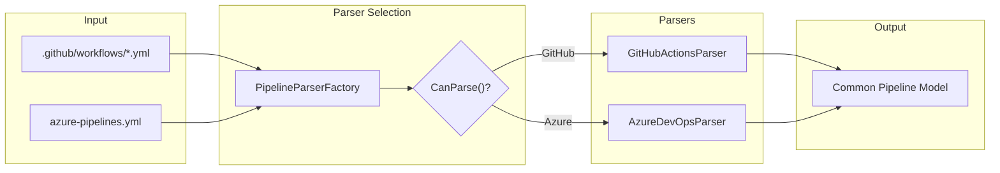
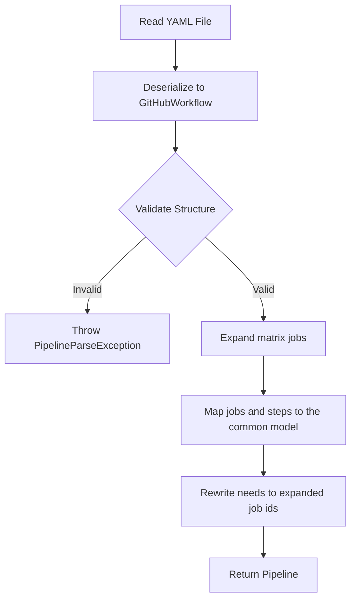
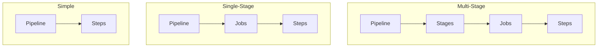

# Parser Architecture

This document describes how PDK parses CI/CD pipeline files from different providers into a common model.

## Overview

The parser layer transforms provider-specific YAML formats (GitHub Actions, Azure DevOps) into PDK's
common pipeline model. Parsers keep pipeline text (scripts, inputs, conditions) **raw**: expressions
such as `${{ }}`, `$( )` and `$[ ]` are evaluated later, per step, by the expression engine in
`PDK.Core.Expressions` (see [Expressions](../../expressions.md)).


```mermaid
flowchart LR
    subgraph Input
        GH[".github/workflows/*.yml"]
        AZ["azure-pipelines.yml"]
    end

    subgraph "Parser Selection"
        Factory["PipelineParserFactory"]
        CanParse{"CanParse()?"}
    end

    subgraph Parsers
        GHP["GitHubActionsParser"]
        AZP["AzureDevOpsParser"]
    end

    subgraph Output
        Pipeline["Common Pipeline Model"]
    end

    GH --> Factory
    AZ --> Factory
    Factory --> CanParse
    CanParse -->|GitHub| GHP
    CanParse -->|Azure| AZP
    GHP --> Pipeline
    AZP --> Pipeline
```

## Core Interfaces

### IPipelineParser

```csharp
public interface IPipelineParser
{
    /// <summary>
    /// Parses YAML content into a pipeline.
    /// </summary>
    Pipeline Parse(string yamlContent);

    /// <summary>
    /// Parses a pipeline file.
    /// </summary>
    Task<Pipeline> ParseFile(string filePath);

    /// <summary>
    /// Determines if this parser can handle the given file.
    /// </summary>
    bool CanParse(string filePath);
}
```

### IPipelineParserWarnings

Both parsers also implement `IPipelineParserWarnings`, which exposes the non-fatal findings of the
last parse (unsupported tasks, ignored sections). `PipelineExecutor` prints them before a run and the
dry-run validator reports them as warnings.

```csharp
public interface IPipelineParserWarnings
{
    IReadOnlyList<string> Warnings { get; }
}
```

### IPipelineParserFactory

```csharp
public interface IPipelineParserFactory
{
    /// <summary>
    /// Gets the appropriate parser for the given file.
    /// </summary>
    IPipelineParser GetParser(string filePath);
}
```

## Parser Factory

The factory (`src/PDK.CLI/PipelineParserFactory.cs`) selects the first parser whose `CanParse`
accepts the file. When none does it explains why: a missing file is a `FileNotFoundException` (exit
code 3), an unreadable file is `PDK-E-FILE-002`, invalid YAML is `PDK-E-PARSER-001` with the line and
column, and a valid YAML file that matches neither provider is `PDK-E-PARSER-006`
("... is not a GitHub Actions workflow or an Azure DevOps pipeline") with hints about the expected
shape.

### Detection Logic

| Parser | Detection Criteria |
|--------|-------------------|
| GitHub Actions | Top-level `jobs:` mapping that deserializes as a workflow, plus an `on:` trigger or a job with `runs-on` (or a reusable-workflow `uses`) |
| Azure DevOps | `.yml` / `.yaml` file with a top-level Azure key (`steps`, `jobs`, `stages`, `pool`, `trigger`, `pr`, `extends`, `resources`, `variables`, `parameters`, `schedules`) that is not shaped like a GitHub workflow |

## GitHub Actions Parser

Location: `src/PDK.Providers/GitHub/GitHubActionsParser.cs`

### Parsing Flow


```mermaid
flowchart TD
    A[Read YAML File] --> B[Deserialize to GitHubWorkflow]
    B --> C{Validate Structure}
    C -->|Invalid| D[Throw PipelineParseException]
    C -->|Valid| E[Expand matrix jobs]
    E --> F[Map jobs and steps to the common model]
    F --> G[Rewrite needs to expanded job ids]
    G --> H[Return Pipeline]
```

### What Is Mapped

| Workflow feature | Common model |
|------------------|--------------|
| `env` at workflow / job / step level | `Pipeline.Variables`, `Job.Environment`, `Step.Environment` (merged later, later levels win) |
| `runs-on` (string, label list, `{ group, labels }`) | `Job.RunsOn` via `RunsOnResolver`: first hosted label (`ubuntu-*`, `windows-*`, `macos-*`), else `self-hosted`, else the first label |
| `container:` (string or `{ image }`) | `Job.Container` |
| `strategy.matrix` (axes, `include`, `exclude`) | one `Job` per combination (`MatrixExpander`): id `<job>-<value>-<value>` (lower-cased, non-alphanumerics collapsed to `-`), display name `<name> (<v1>, <v2>)`, `Job.Matrix`, `${{ matrix.* }}` substituted at parse time |
| `needs` | `Job.DependsOn`; a dependency on a matrix job targets every expanded instance |
| `if` (job and step) | `Condition` with the raw expression |
| `timeout-minutes` (literal) | `Job.Timeout` / `Step.TimeoutMinutes` |
| `continue-on-error`, `working-directory`, `shell`, `defaults.run` | step properties (`shell` templates such as `bash -e {0}` are reduced to the shell name) |
| `services:` | ignored with a warning |
| job-level `uses:` (reusable workflow) | a single `Unknown` step; skipped with a warning at run time |

### Action Mapping

`ActionMapper.MapStep` turns `uses:` references into step types:

```csharp
return key switch
{
    "actions/checkout"          => StepType.Checkout,
    "actions/upload-artifact"   => StepType.UploadArtifact,   // name, path, retention-days, if-no-files-found
    "actions/download-artifact" => StepType.DownloadArtifact, // name, path
    "docker/build-push-action"  => StepType.Docker,           // file, context, build-args → docker build
    _ when SetupActions.Contains(key) || key.StartsWith("actions/setup-") => StepType.Setup,
    _ => StepType.Unknown
};
```

`SetupActions` contains `actions/setup-*`, `actions/cache` (and `/restore`, `/save`),
`codecov/codecov-action`, `docker/setup-buildx-action`, `docker/setup-qemu-action`,
`docker/login-action`, `gradle/actions/setup-gradle` and `gradle/gradle-build-action`. `Setup` steps are
no-ops at run time; `Unknown` steps (marketplace actions, `./local` actions, `docker://` references)
are skipped with a warning or fail with `--strict`. `run:` steps become `Script` (or `PowerShell` for
`pwsh` / `powershell`); the original reference is kept in `Step.ActionReference` and `With["_action"]`.

### Validation

The parser validates:
- At least one job exists and each job is a mapping
- Each job has `runs-on` (or is a reusable-workflow job) and at least one step
- Each step has exactly one of `uses` / `run`
- `needs` refers to existing jobs and forms no cycle

## Azure DevOps Parser

Location: `src/PDK.Providers/AzureDevOps/AzureDevOpsParser.cs`

### Pipeline Hierarchy

Azure DevOps supports multiple hierarchy patterns; exactly one of them must be used at the top level:


```mermaid
graph TD
    subgraph "Multi-Stage"
        P1[Pipeline] --> S1[Stages]
        S1 --> J1[Jobs]
        J1 --> ST1[Steps]
    end

    subgraph "Single-Stage"
        P2[Pipeline] --> J2[Jobs]
        J2 --> ST2[Steps]
    end

    subgraph "Simple"
        P3[Pipeline] --> ST3[Steps]
    end
```

A steps-only pipeline becomes a single job with id `default`.

### What Is Mapped

| Pipeline feature | Common model |
|------------------|--------------|
| `variables:` (mapping or `- name/value` list) at pipeline, stage and job level | `Pipeline.Variables` / `Job.Variables` (`AzureVariableParser`); `- group:` and `- template:` entries are ignored with a warning |
| `pool.vmImage` / `pool.name` | `Job.RunsOn` (a pool `name` means `self-hosted`; no pool falls back to `ubuntu-latest`) |
| `container:` | `Job.Container` |
| `stages` | flattened to jobs with ids `<Stage>_<Job>`; stage `dependsOn` (explicit, or the previous stage by default) becomes a dependency on every job of that stage; a stage `condition:` is combined with the job condition with `and()` |
| `dependsOn` (job) | `Job.DependsOn` (prefixed with the stage name in multi-stage pipelines) |
| `condition:` (job and step) | `Condition` with the raw expression |
| `deployment:` jobs | the `strategy.runOnce` / `rolling` / `canary` `deploy` steps; lifecycle hooks (`preDeploy`, `routeTraffic`, `postRouteTraffic`) are ignored with a warning |
| `strategy.matrix` | one job per leg with `Job.Matrix` |
| `timeoutInMinutes`, `continueOnError`, `enabled`, `workingDirectory`, `env`, `name`, `displayName` | step / job properties |
| `resources:`, `services:` | ignored with a warning |
| `template:` / `extends:`, `${{ if }}` / `${{ each }}` / `${{ insert }}` insertions | rejected with a dedicated `PipelineParseException` |

### Task Mapping

`AzureStepMapper.MapStep` maps steps to step types:

```csharp
return key switch
{
    "dotnetcorecli"            => StepType.Dotnet,           // command, projects, arguments, ...
    "powershell"               => StepType.PowerShell,
    "bash"                     => StepType.Script,
    "cmdline"                  => StepType.Script,
    "docker"                   => StepType.Docker,
    "npm"                      => StepType.Npm,
    "maven"                    => StepType.Maven,
    "gradle"                   => StepType.Gradle,
    "copyfiles"                => StepType.FileOperation,
    "publishbuildartifacts"    => StepType.UploadArtifact,
    "publishpipelineartifact"  => StepType.UploadArtifact,
    "downloadbuildartifacts"   => StepType.DownloadArtifact,
    "downloadpipelineartifact" => StepType.DownloadArtifact,
    _ when SetupTasks.Contains(key) => StepType.Setup,      // UseDotNet, NodeTool, UseNode, UsePythonVersion,
    _ => StepType.Unknown                                    // JavaToolInstaller, GoTool, NuGetToolInstaller, Cache
};
```

Script shortcuts map to `Script` (`script:`, `bash:`) or `PowerShell` (`pwsh:`, `powershell:`);
`checkout:` maps to `Checkout` (`checkout: none` keeps a disabled step), `publish:` to
`UploadArtifact` and `download:` to `DownloadArtifact` (`download: none` is disabled). Unknown tasks
produce a parser warning and an `Unknown` step. Task inputs are stored raw in `Step.With` together
with `_task` and `_version`; `$( )` macros inside them are resolved at run time for known variables
only.

### Hierarchy Flattening

Multi-stage pipelines are flattened to jobs:

```csharp
// Stage "Build" with job "CompileCode" becomes job "Build_CompileCode"
var jobId = $"{stageName}_{azureJob.Identifier}";
```

## Common Pipeline Model

Both parsers produce the same output (`src/PDK.Core/Models`):

```csharp
public class Pipeline
{
    public string Name { get; set; }
    public Dictionary<string, Job> Jobs { get; set; }
    public Dictionary<string, string> Variables { get; set; }
    public PipelineProvider Provider { get; set; }
}

public class Job
{
    public string Id { get; set; }
    public string Name { get; set; }
    public string RunsOn { get; set; }
    public string? Container { get; set; }
    public List<Step> Steps { get; set; }
    public List<string> DependsOn { get; set; }
    public Condition? Condition { get; set; }
    public TimeSpan? Timeout { get; set; }
    public Dictionary<string, string> Environment { get; set; }
    public Dictionary<string, string> Variables { get; set; }
    public Dictionary<string, string>? Matrix { get; set; }
    public string? Stage { get; set; }
}

public class Step
{
    public string? Id { get; set; }
    public string Name { get; set; }
    public StepType Type { get; set; }
    public string? ActionReference { get; set; }
    public string? Script { get; set; }
    public string Shell { get; set; }
    public Dictionary<string, string> With { get; set; }
    public Dictionary<string, string> Environment { get; set; }
    public bool ContinueOnError { get; set; }
    public Condition? Condition { get; set; }
    public string? WorkingDirectory { get; set; }
    public bool Enabled { get; set; }
    public int? TimeoutMinutes { get; set; }
    public ArtifactDefinition? Artifact { get; set; }
}
```

`StepType` values produced by the parsers: `Checkout`, `Script`, `PowerShell`, `Dotnet`, `Npm`,
`Docker`, `Maven`, `Gradle`, `FileOperation`, `UploadArtifact`, `DownloadArtifact`, `Setup`,
`Unknown`. (`Bash` and `Python` still exist in the enum but are no longer produced; bash scripts are
`Script` steps with `Shell = "bash"`.)

`JobGraph` (`src/PDK.Core/Models/JobGraph.cs`) orders the jobs of a `Pipeline` by their dependencies
and resolves job references by id or name.

## Error Handling

Parsers translate YAML problems and structural errors into `PipelineParseException` with an error
code, the file, the job/step and suggestions:

```csharp
throw new PipelineParseException(
    ErrorCodes.MissingRequiredField,
    $"Job '{jobId}' is missing required field 'runs-on'",
    filePath,
    jobId,
    suggestions: new[] { "Add runs-on: ubuntu-latest" });
```

### Common Errors

| Error | Code | Solution |
|-------|------|----------|
| Invalid YAML | `PDK-E-PARSER-001` | Fix the reported line |
| "No jobs defined" / job without steps | `PDK-E-PARSER-003` / `PDK-E-PARSER-005` | Add at least one job and step |
| "Job missing runs-on" | `PDK-E-PARSER-003` | Specify `runs-on: ubuntu-latest` |
| "Step has both uses and run" | `PDK-E-PARSER-005` | Use either `uses` or `run` |
| Unknown / self dependency | `PDK-E-PARSER-007` / `PDK-E-PARSER-008` | Fix `needs` / `dependsOn` |
| Circular dependency | `PDK-E-PARSER-004` | Remove the circular reference |
| Azure template or `${{ if }}` insertion | `PDK-E-PARSER-005` | Expand the template inline |

See [Error codes](../../errors.md) for the full list.

## Adding a New Parser

To add support for a new CI/CD platform:

1. **Create provider-specific models**:
```csharp
namespace PDK.Providers.GitLab.Models;

public class GitLabPipeline
{
    public Dictionary<string, GitLabJob>? Jobs { get; set; }
}
```

2. **Implement IPipelineParser** (and `IPipelineParserWarnings`):
```csharp
public class GitLabCIParser : IPipelineParser, IPipelineParserWarnings
{
    public IReadOnlyList<string> Warnings { get; private set; } = [];

    public bool CanParse(string filePath)
    {
        return filePath.EndsWith(".gitlab-ci.yml");
    }

    public async Task<Pipeline> ParseFile(string filePath)
    {
        // Parse and map to common model
    }
}
```

3. **Register in DI container**:
```csharp
services.AddSingleton<IPipelineParser, GitLabCIParser>();
```

See [Custom Provider Guide](../extending/custom-provider.md) for detailed instructions.

## Testing Parsers

```csharp
public class GitHubActionsParserTests
{
    [Fact]
    public async Task ParseFile_ValidWorkflow_ReturnsPipeline()
    {
        // Arrange
        var parser = new GitHubActionsParser();
        var yaml = """
            name: CI
            on: push
            jobs:
              build:
                runs-on: ubuntu-latest
                steps:
                  - run: echo "Hello"
            """;
        var filePath = CreateTempFile(yaml);

        // Act
        var pipeline = await parser.ParseFile(filePath);

        // Assert
        pipeline.Name.Should().Be("CI");
        pipeline.Jobs.Should().HaveCount(1);
        pipeline.Jobs["build"].Steps.Should().HaveCount(1);
    }
}
```

## Next Steps

- [Runner Architecture](runners.md) - How parsed pipelines are executed
- [Expressions](../../expressions.md) - What the expression engine evaluates at run time
- [Custom Provider Guide](../extending/custom-provider.md) - Adding new parsers
- [Data Flow](data-flow.md) - Complete execution flow
