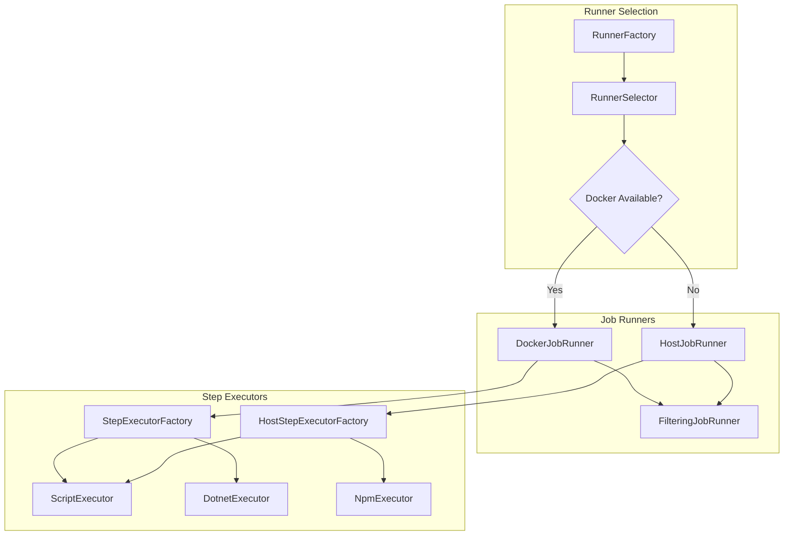
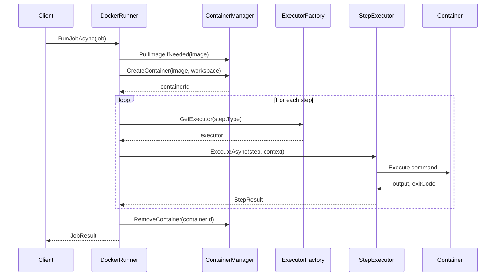
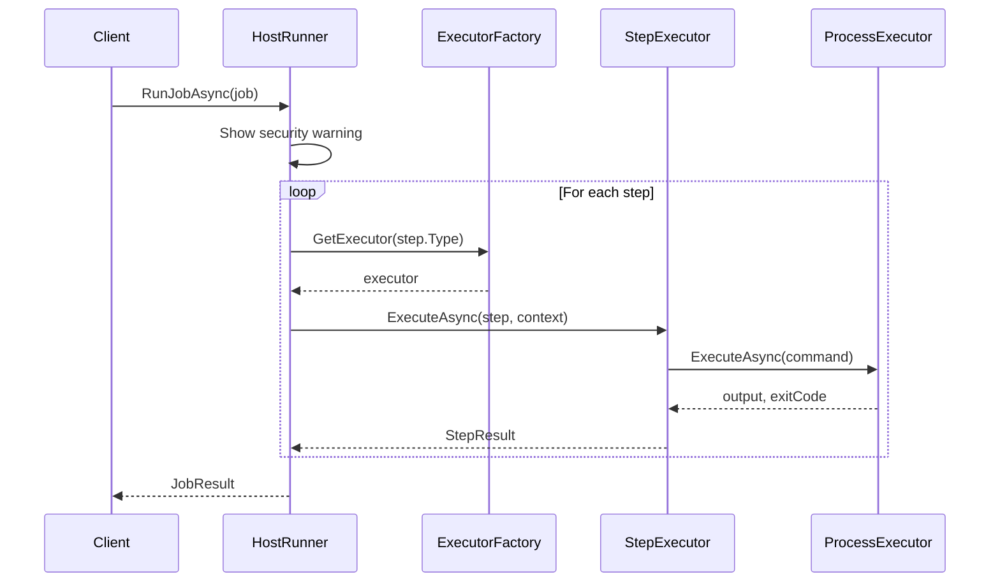
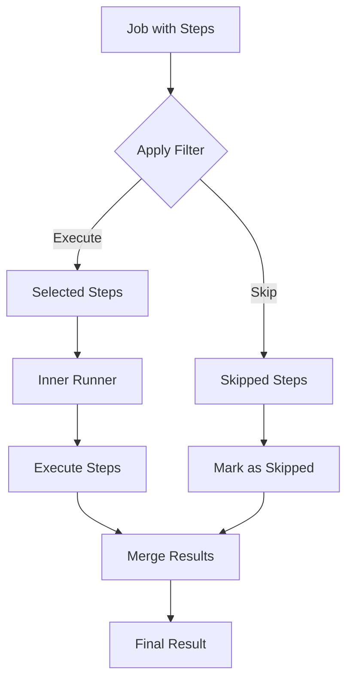

# Runner Architecture

This document describes how PDK executes pipeline jobs and steps.

## Overview

The runner layer is responsible for executing parsed pipelines. It supports two execution modes:

- **Docker Mode**: Steps run in isolated Docker containers
- **Host Mode**: Steps run directly on the local machine



## Core Interfaces

### IJobRunner

```csharp
public interface IJobRunner
{
    /// <summary>
    /// Executes a job and returns the result.
    /// </summary>
    Task<JobExecutionResult> RunJobAsync(
        Job job,
        string workspacePath,
        CancellationToken cancellationToken);
}
```

### IStepExecutor

```csharp
public interface IStepExecutor
{
    /// <summary>
    /// The step type this executor handles (e.g., "script", "dotnet").
    /// </summary>
    string StepType { get; }

    /// <summary>
    /// Executes a step in a Docker container.
    /// </summary>
    Task<StepExecutionResult> ExecuteAsync(
        Step step,
        ExecutionContext context,
        CancellationToken cancellationToken);
}
```

### IHostStepExecutor

```csharp
public interface IHostStepExecutor
{
    /// <summary>
    /// The step type this executor handles.
    /// </summary>
    string StepType { get; }

    /// <summary>
    /// Executes a step on the host machine.
    /// </summary>
    Task<StepExecutionResult> ExecuteAsync(
        Step step,
        HostExecutionContext context,
        CancellationToken cancellationToken);
}
```

## Runner Selection

The `RunnerFactory` chooses the appropriate runner:

```csharp
public class RunnerFactory : IRunnerFactory
{
    public IJobRunner CreateRunner(RunnerType type)
    {
        return type switch
        {
            RunnerType.Docker => _dockerRunner,
            RunnerType.Host => _hostRunner,
            RunnerType.Auto => SelectAutomatically(),
            _ => throw new NotSupportedException()
        };
    }

    private IJobRunner SelectAutomatically()
    {
        // Check Docker availability
        if (_dockerDetector.IsAvailable)
            return _dockerRunner;

        // Fall back to host mode with warning
        _logger.LogWarning("Docker unavailable, using host mode");
        return _hostRunner;
    }
}
```

## Docker Job Runner

Location: `src/PDK.Runners/DockerJobRunner.cs`

### Execution Flow



### Container Setup

```csharp
private async Task<string> CreateContainerAsync(Job job, string workspacePath)
{
    var image = _imageMapper.Map(job.RunsOn);

    return await _containerManager.CreateContainerAsync(
        new ContainerConfig
        {
            Image = image,
            Name = $"pdk-job-{job.Id}-{Guid.NewGuid():N}",
            WorkDir = "/workspace",
            Mounts = new[]
            {
                new Mount
                {
                    Source = workspacePath,
                    Target = "/workspace",
                    Type = "bind"
                }
            },
            Environment = job.Environment
        });
}
```

### Image Mapping

The `ImageMapper` converts runner names to Docker images:

| Runner Name | Docker Image |
|-------------|--------------|
| `ubuntu-latest` | `ubuntu:latest` |
| `ubuntu-22.04` | `ubuntu:22.04` |
| `ubuntu-20.04` | `ubuntu:20.04` |
| `windows-latest` | `mcr.microsoft.com/windows/servercore:ltsc2022` |

## Host Job Runner

Location: `src/PDK.Runners/HostJobRunner.cs`

### Execution Flow



### Security Warning

Host mode shows a security warning:

```csharp
_logger.LogWarning(
    "Running in host mode. Steps will execute directly on your machine " +
    "without sandboxing. Ensure you trust the pipeline content.");
```

## Step Executors

### Script Executor

Executes bash/shell scripts:

```csharp
public class ScriptStepExecutor : IStepExecutor
{
    public string StepType => "script";

    public async Task<StepExecutionResult> ExecuteAsync(
        Step step, ExecutionContext context, CancellationToken ct)
    {
        // Create temp script file
        var scriptPath = $"/tmp/pdk-script-{Guid.NewGuid()}.sh";
        await WriteScriptAsync(context.ContainerId, scriptPath, step.Script);

        // Make executable
        await _containerManager.ExecuteCommandAsync(
            context.ContainerId, $"chmod +x {scriptPath}", ct);

        // Execute script
        var result = await _containerManager.ExecuteCommandAsync(
            context.ContainerId, scriptPath, ct);

        // Cleanup
        await _containerManager.ExecuteCommandAsync(
            context.ContainerId, $"rm -f {scriptPath}", ct);

        return new StepExecutionResult
        {
            Success = result.ExitCode == 0,
            ExitCode = result.ExitCode,
            Output = result.Output
        };
    }
}
```

### Dotnet Executor

Executes .NET CLI commands:

```csharp
public class DotnetStepExecutor : IStepExecutor
{
    public string StepType => "dotnet";

    public async Task<StepExecutionResult> ExecuteAsync(
        Step step, ExecutionContext context, CancellationToken ct)
    {
        var command = step.With.GetValueOrDefault("command", "build");
        var projects = step.With.GetValueOrDefault("projects", ".");

        var args = command switch
        {
            "build" => $"dotnet build {projects}",
            "test" => $"dotnet test {projects}",
            "publish" => $"dotnet publish {projects}",
            "restore" => $"dotnet restore {projects}",
            _ => throw new NotSupportedException($"Unknown command: {command}")
        };

        return await ExecuteCommandAsync(context, args, ct);
    }
}
```

### Step Executor Factory

Resolves executors by step type:

```csharp
public class StepExecutorFactory
{
    private readonly Dictionary<string, IStepExecutor> _executors;

    public StepExecutorFactory(IEnumerable<IStepExecutor> executors)
    {
        _executors = executors.ToDictionary(
            e => e.StepType.ToLowerInvariant(),
            e => e);
    }

    public IStepExecutor GetExecutor(string stepType)
    {
        if (_executors.TryGetValue(stepType.ToLowerInvariant(), out var executor))
            return executor;

        var available = string.Join(", ", _executors.Keys);
        throw new NotSupportedException(
            $"No executor for '{stepType}'. Available: {available}");
    }
}
```

## Execution Context

### Docker Context

```csharp
public record ExecutionContext(
    string ContainerId,
    IContainerManager ContainerManager,
    string WorkspacePath,
    string ContainerWorkspacePath,
    Dictionary<string, string> Environment,
    string? WorkingDirectory,
    JobMetadata JobInfo,
    ArtifactContext? ArtifactContext);
```

### Host Context

```csharp
public record HostExecutionContext(
    IProcessExecutor ProcessExecutor,
    string WorkspacePath,
    Dictionary<string, string> Environment,
    string? WorkingDirectory,
    OSPlatform Platform,
    JobMetadata JobInfo,
    ArtifactContext? ArtifactContext)
{
    public string ResolvePath(string relativePath)
    {
        if (Path.IsPathRooted(relativePath))
            return relativePath;
        return Path.GetFullPath(Path.Combine(WorkspacePath, relativePath));
    }
}
```

## Filtering Job Runner

The `FilteringJobRunner` is a decorator that applies step filtering:



```csharp
public class FilteringJobRunner : IJobRunner
{
    private readonly IJobRunner _inner;
    private readonly IStepFilter _filter;

    public async Task<JobExecutionResult> RunJobAsync(
        Job job, string workspace, CancellationToken ct)
    {
        // Categorize steps
        var (toExecute, toSkip) = CategorizeSteps(job.Steps);

        // Create filtered job
        var filteredJob = job with { Steps = toExecute };

        // Execute filtered job
        var result = await _inner.RunJobAsync(filteredJob, workspace, ct);

        // Merge skipped steps into results
        return MergeWithSkipped(result, toSkip);
    }
}
```

## Result Models

### StepExecutionResult

```csharp
public record StepExecutionResult
{
    public required string StepName { get; init; }
    public required bool Success { get; init; }
    public required int ExitCode { get; init; }
    public required string Output { get; init; }
    public string? ErrorOutput { get; init; }
    public required TimeSpan Duration { get; init; }
    public required DateTime StartTime { get; init; }
    public required DateTime EndTime { get; init; }
}
```

### JobExecutionResult

```csharp
public record JobExecutionResult
{
    public required string JobName { get; init; }
    public required bool Success { get; init; }
    public required IList<StepExecutionResult> StepResults { get; init; }
    public required TimeSpan Duration { get; init; }
    public required DateTime StartTime { get; init; }
    public required DateTime EndTime { get; init; }
    public string? ErrorMessage { get; init; }
}
```

## Error Handling

### Continue on Error

Steps with `ContinueOnError = true` don't fail the job:

```csharp
foreach (var step in job.Steps)
{
    var result = await ExecuteStepAsync(step, context, ct);
    stepResults.Add(result);

    if (!result.Success && !step.ContinueOnError)
    {
        // Stop execution
        break;
    }
}
```

### Exception Handling

```csharp
try
{
    var result = await executor.ExecuteAsync(step, context, ct);
    return result;
}
catch (OperationCanceledException)
{
    return new StepExecutionResult
    {
        Success = false,
        Output = "Step cancelled"
    };
}
catch (Exception ex)
{
    _logger.LogError(ex, "Step {Step} failed", step.Name);
    return new StepExecutionResult
    {
        Success = false,
        Output = ex.Message
    };
}
```

## Adding a New Executor

1. **Implement IStepExecutor**:
```csharp
public class PythonStepExecutor : IStepExecutor
{
    public string StepType => "python";

    public async Task<StepExecutionResult> ExecuteAsync(
        Step step, ExecutionContext context, CancellationToken ct)
    {
        // Implementation
    }
}
```

2. **Register in DI**:
```csharp
services.AddSingleton<IStepExecutor, PythonStepExecutor>();
```

See [Custom Executor Guide](../extending/custom-executor.md) for details.

## Next Steps

- [CLI Architecture](cli.md) - How commands work
- [Data Flow](data-flow.md) - Complete execution flow
- [Custom Executor Guide](../extending/custom-executor.md) - Adding executors
