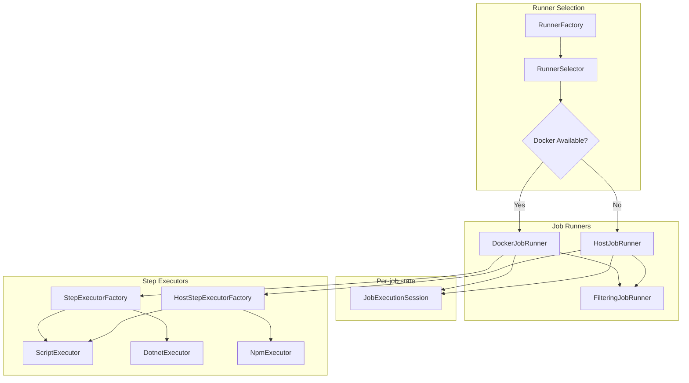
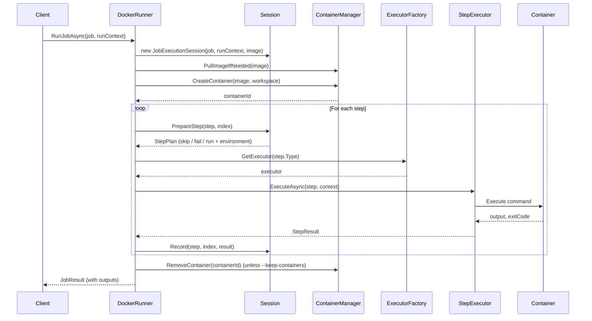
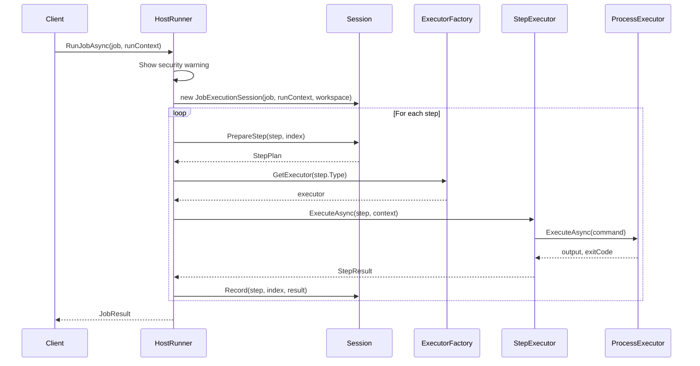
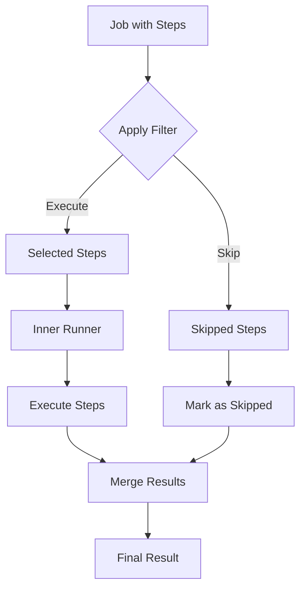

# Runner Architecture

This document describes how PDK executes pipeline jobs and steps.

## Overview

The runner layer is responsible for executing parsed pipelines. It supports two execution modes:

- **Docker Mode**: Steps run in an isolated Docker container (one container per job)
- **Host Mode**: Steps run directly on the local machine


```mermaid
flowchart TB
    subgraph "Runner Selection"
        Factory[RunnerFactory]
        Selector[RunnerSelector]
        DockerCheck{Docker Available?}
    end

    subgraph "Job Runners"
        Docker[DockerJobRunner]
        Host[HostJobRunner]
        Filtering[FilteringJobRunner]
    end

    subgraph "Per-job state"
        Session[JobExecutionSession]
    end

    subgraph "Step Executors"
        DockerFactory[StepExecutorFactory]
        HostFactory[HostStepExecutorFactory]
        Script[ScriptExecutor]
        Dotnet[DotnetExecutor]
        Npm[NpmExecutor]
    end

    Factory --> Selector
    Selector --> DockerCheck
    DockerCheck -->|Yes| Docker
    DockerCheck -->|No| Host
    Docker --> Filtering
    Host --> Filtering
    Docker --> Session
    Host --> Session
    Docker --> DockerFactory
    Host --> HostFactory
    DockerFactory --> Script
    DockerFactory --> Dotnet
    HostFactory --> Script
    HostFactory --> Npm
```

## Core Interfaces

### IJobRunner

```csharp
public interface IJobRunner
{
    /// <summary>
    /// Executes a job with the run-wide context (pipeline, secrets, variables,
    /// dependency results and outputs, event name, run id, policies).
    /// </summary>
    Task<JobExecutionResult> RunJobAsync(
        Job job,
        JobRunContext runContext,
        CancellationToken cancellationToken);

    /// <summary>
    /// Legacy overload: runs the job with a minimal context for the workspace.
    /// </summary>
    Task<JobExecutionResult> RunJobAsync(
        Job job,
        string workspacePath,
        CancellationToken cancellationToken);
}
```

`PipelineExecutor` builds one `JobRunContext` per job (`src/PDK.Runners/JobRunContext.cs`) with the
results and outputs of the jobs it depends on, then asks `JobConditionEvaluator` whether the job runs
at all before calling the runner.

### IStepExecutor

```csharp
public interface IStepExecutor
{
    /// <summary>
    /// The step type this executor handles (e.g., "script", "dotnet").
    /// </summary>
    string StepType { get; }

    /// <summary>
    /// Executes a step in a Docker container.
    /// </summary>
    Task<StepExecutionResult> ExecuteAsync(
        Step step,
        ExecutionContext context,
        CancellationToken cancellationToken);
}
```

### IHostStepExecutor

```csharp
public interface IHostStepExecutor
{
    /// <summary>
    /// The step type this executor handles.
    /// </summary>
    string StepType { get; }

    /// <summary>
    /// Executes a step on the host machine.
    /// </summary>
    Task<StepExecutionResult> ExecuteAsync(
        Step step,
        HostExecutionContext context,
        CancellationToken cancellationToken);
}
```

## Runner Selection

`RunnerSelector` chooses the runner for the requested `RunnerType` (`--docker`, `--host`,
`--runner auto` or the `runner` configuration section) and the first job's needs
(`RunnerCapabilities`: custom images and Docker steps require Docker). With `auto`, Docker is
preferred and the host runner is the fallback when no daemon is reachable; `--docker` without a
daemon fails with exit code 4. `RunnerFactory` then creates the runner:

```csharp
public class RunnerFactory : IRunnerFactory
{
    public IJobRunner CreateRunner(RunnerType type)
    {
        return type switch
        {
            RunnerType.Docker => _dockerRunner,
            RunnerType.Host => _hostRunner,
            _ => throw new NotSupportedException()
        };
    }
}
```

## Docker Job Runner

Location: `src/PDK.Runners/DockerJobRunner.cs`

### Execution Flow


```mermaid
sequenceDiagram
    participant Client
    participant DockerRunner
    participant Session
    participant ContainerManager
    participant ExecutorFactory
    participant StepExecutor
    participant Container

    Client->>DockerRunner: RunJobAsync(job, runContext)
    DockerRunner->>Session: new JobExecutionSession(job, runContext, image)
    DockerRunner->>ContainerManager: PullImageIfNeeded(image)
    DockerRunner->>ContainerManager: CreateContainer(image, workspace)
    ContainerManager-->>DockerRunner: containerId

    loop For each step
        DockerRunner->>Session: PrepareStep(step, index)
        Session-->>DockerRunner: StepPlan (skip / fail / run + environment)
        DockerRunner->>ExecutorFactory: GetExecutor(step.Type)
        ExecutorFactory-->>DockerRunner: executor
        DockerRunner->>StepExecutor: ExecuteAsync(step, context)
        StepExecutor->>Container: Execute command
        Container-->>StepExecutor: output, exitCode
        StepExecutor-->>DockerRunner: StepResult
        DockerRunner->>Session: Record(step, index, result)
    end

    DockerRunner->>ContainerManager: RemoveContainer(containerId) (unless --keep-containers)
    DockerRunner-->>Client: JobResult (with outputs)
```

### Container Setup

```csharp
// 1. Resolve the image: an explicit job container wins over the runner label mapping
var image = string.IsNullOrWhiteSpace(job.Container)
    ? _imageMapper.MapRunnerToImage(job.RunsOn)
    : job.Container.Trim();

// 2. Session: expression contexts, exported environment, step outcomes
session = new JobExecutionSession(job, effectiveRun, ContainerWorkspace, image, _logger);

// 3. Create the container with the workspace bind-mounted at /workspace
containerId = await _containerManager.CreateContainerAsync(new ContainerConfig
{
    Image = image,
    WorkspacePath = workspacePath,
    MountDockerSocket = job.Steps.Any(s => s.Type == StepType.Docker),
    MemoryLimit = runContext.ContainerMemoryLimit,
    CpuLimit = runContext.ContainerCpuLimit
});
```

The Docker socket is mounted into the container only when the job contains Docker steps; memory and
CPU limits come from the `docker` configuration section; `--no-cache` forces an image pull.

### Image Mapping

The `ImageMapper` (`src/PDK.Runners/Docker/ImageMapper.cs`) converts runner labels to Docker images;
anything that is not a known label is treated as an image name (`runs-on: node:18`), and an
unresolved `${{ }}` expression falls back to the `ubuntu-latest` image:

| Runner Name | Docker Image |
|-------------|--------------|
| `ubuntu-latest`, `ubuntu-22.04` | `buildpack-deps:jammy` |
| `ubuntu-20.04` | `buildpack-deps:focal` |
| `windows-latest`, `windows-2022` | `mcr.microsoft.com/windows/servercore:ltsc2022` |
| `windows-2019` | `mcr.microsoft.com/windows/servercore:ltsc2019` |
| `node:18`, `mcr.microsoft.com/dotnet/sdk:8.0`, ... | used as-is |

## Host Job Runner

Location: `src/PDK.Runners/HostJobRunner.cs`

### Execution Flow


```mermaid
sequenceDiagram
    participant Client
    participant HostRunner
    participant Session
    participant ExecutorFactory
    participant StepExecutor
    participant ProcessExecutor

    Client->>HostRunner: RunJobAsync(job, runContext)
    HostRunner->>HostRunner: Show security warning
    HostRunner->>Session: new JobExecutionSession(job, runContext, workspace)

    loop For each step
        HostRunner->>Session: PrepareStep(step, index)
        Session-->>HostRunner: StepPlan
        HostRunner->>ExecutorFactory: GetExecutor(step.Type)
        ExecutorFactory-->>HostRunner: executor
        HostRunner->>StepExecutor: ExecuteAsync(step, context)
        StepExecutor->>ProcessExecutor: ExecuteAsync(command)
        ProcessExecutor-->>StepExecutor: output, exitCode
        StepExecutor-->>HostRunner: StepResult
        HostRunner->>Session: Record(step, index, result)
    end

    HostRunner-->>Client: JobResult
```

Host steps run in the workspace directory with the exported environment on top of the environment of
the `pdk` process. Custom images and Docker steps need Docker (`RunnerCapabilities`); `--runner auto`
falls back to the host runner only when the job does not need them.

### Security Warning

Host mode shows a security warning:

```csharp
_logger.LogWarning(
    "Running in host mode. Steps will execute directly on your machine " +
    "without sandboxing. Ensure you trust the pipeline content.");
```

## Job Execution Session

`JobExecutionSession` (`src/PDK.Runners/JobExecutionSession.cs`) holds the per-job state that both
runners share and implements the execution semantics described in
[Expressions](../../expressions.md#execution-semantics):

- `PrepareStep(step, index)` builds the expression context for the step (`steps.*`, dynamic `env`,
  job status), evaluates the condition (default `success()` / `succeeded()`), expands `${{ }}` /
  `$( )` / `$[ ]` in the step's name, script, inputs, env, working directory and artifact fields, and
  returns a `StepPlan`: skip (with reason: disabled, condition false, setup no-op, unsupported step),
  fail (invalid expression, unsupported step with `--strict`) or run with the complete environment
  (platform variables, PDK variables and secrets by name, the `GITHUB_OUTPUT` / `GITHUB_ENV` /
  `GITHUB_PATH` / `GITHUB_STEP_SUMMARY` files, `PATH` additions) and the per-step timeout.
- `Record(step, index, result)` updates the job status (a failure that is not `continue-on-error`
  flips it to `Failure`), appends the `steps.<id>` outcome, and harvests outputs and environment
  additions from the command files and from `::set-output` / `::set-env` / `::add-path` /
  `::add-mask` / `##vso[task.setvariable]` / `##vso[task.prependpath]` / `##vso[task.setsecret]`.
- `Outputs` are returned in `JobExecutionResult.Outputs` and become `needs.*` / `dependencies.*`
  for dependent jobs; `AdditionalMaskValues` feed the output masking.

The per-run scratch files live in `.pdk/runtime/<run id>/<job>/step-<n>/` and are removed after the
run. PDK's own `${VAR}` expansion of step inputs, environment values and working directories
(`VariableExpander`) is applied by the runner right before the executor is called; scripts are not
rewritten.

## Step Executors

### Script Executor

Executes shell scripts (bash, sh, pwsh, python, ...):

```csharp
public class ScriptStepExecutor : IStepExecutor
{
    public string StepType => "script";

    public async Task<StepExecutionResult> ExecuteAsync(
        Step step, ExecutionContext context, CancellationToken ct)
    {
        // Create temp script file
        var scriptPath = $"/tmp/pdk-script-{Guid.NewGuid()}.sh";
        await WriteScriptAsync(context.ContainerId, scriptPath, step.Script);

        // Make executable
        await _containerManager.ExecuteCommandAsync(
            context.ContainerId, $"chmod +x {scriptPath}", ct);

        // Execute script
        var result = await _containerManager.ExecuteCommandAsync(
            context.ContainerId, scriptPath, ct);

        // Cleanup
        await _containerManager.ExecuteCommandAsync(
            context.ContainerId, $"rm -f {scriptPath}", ct);

        return new StepExecutionResult
        {
            Success = result.ExitCode == 0,
            ExitCode = result.ExitCode,
            Output = result.Output
        };
    }
}
```

### Dotnet Executor

Executes .NET CLI commands:

```csharp
public class DotnetStepExecutor : IStepExecutor
{
    public string StepType => "dotnet";

    public async Task<StepExecutionResult> ExecuteAsync(
        Step step, ExecutionContext context, CancellationToken ct)
    {
        var command = step.With.GetValueOrDefault("command", "build");
        var projects = step.With.GetValueOrDefault("projects", ".");

        var args = command switch
        {
            "build" => $"dotnet build {projects}",
            "test" => $"dotnet test {projects}",
            "publish" => $"dotnet publish {projects}",
            "restore" => $"dotnet restore {projects}",
            _ => throw new NotSupportedException($"Unknown command: {command}")
        };

        return await ExecuteCommandAsync(context, args, ct);
    }
}
```

### Step Executor Factory

Resolves executors by step type:

```csharp
public class StepExecutorFactory
{
    private readonly Dictionary<string, IStepExecutor> _executors;

    public StepExecutorFactory(IEnumerable<IStepExecutor> executors)
    {
        _executors = executors.ToDictionary(
            e => e.StepType.ToLowerInvariant(),
            e => e);
    }

    public IStepExecutor GetExecutor(string stepType)
    {
        if (_executors.TryGetValue(stepType.ToLowerInvariant(), out var executor))
            return executor;

        var available = string.Join(", ", _executors.Keys);
        throw new NotSupportedException(
            $"No executor for '{stepType}'. Available: {available}");
    }
}
```

`Setup` and `Unknown` steps never reach an executor: the session skips them (or fails them with
`--strict`) before the runner looks one up.

## Execution Context

### Docker Context

```csharp
public record ExecutionContext(
    string ContainerId,
    IContainerManager ContainerManager,
    string WorkspacePath,
    string ContainerWorkspacePath,
    Dictionary<string, string> Environment,
    string? WorkingDirectory,
    JobMetadata JobInfo,
    ArtifactContext? ArtifactContext,
    Action<string>? OutputLineHandler,
    TimeSpan? Timeout);
```

### Host Context

```csharp
public record HostExecutionContext(
    IProcessExecutor ProcessExecutor,
    string WorkspacePath,
    Dictionary<string, string> Environment,
    string? WorkingDirectory,
    OSPlatform Platform,
    JobMetadata JobInfo,
    ArtifactContext? ArtifactContext,
    Action<string>? OutputLineHandler,
    TimeSpan? Timeout)
{
    public string ResolvePath(string relativePath)
    {
        if (Path.IsPathRooted(relativePath))
            return relativePath;
        return Path.GetFullPath(Path.Combine(WorkspacePath, relativePath));
    }
}
```

## Filtering Job Runner

The `FilteringJobRunner` is a decorator that applies step filtering:


```mermaid
flowchart TD
    Job[Job with Steps] --> Filter{Apply Filter}
    Filter -->|Execute| Selected[Selected Steps]
    Filter -->|Skip| Skipped[Skipped Steps]
    Selected --> Runner[Inner Runner]
    Runner --> Execute[Execute Steps]
    Execute --> Merge[Merge Results]
    Skipped --> SkipResult[Mark as Skipped]
    SkipResult --> Merge
    Merge --> Result[Final Result]
```

```csharp
public class FilteringJobRunner : IJobRunner
{
    private readonly IJobRunner _inner;
    private readonly IStepFilter _filter;

    public async Task<JobExecutionResult> RunJobAsync(
        Job job, JobRunContext runContext, CancellationToken ct)
    {
        // Categorize steps
        var (toExecute, toSkip) = CategorizeSteps(job);

        // Create filtered job
        var filteredJob = CloneWithSteps(job, toExecute);

        // Execute filtered job
        var result = await _inner.RunJobAsync(filteredJob, runContext, ct);

        // Merge skipped steps into results
        return MergeWithSkipped(result, toSkip);
    }
}
```

## Result Models

### StepExecutionResult

```csharp
public record StepExecutionResult
{
    public string StepName { get; init; }
    public bool Success { get; init; }
    public int ExitCode { get; init; }
    public string Output { get; init; }
    public string ErrorOutput { get; init; }
    public TimeSpan Duration { get; init; }
    public DateTimeOffset StartTime { get; init; }
    public DateTimeOffset EndTime { get; init; }
    public bool Skipped { get; init; }          // condition false, disabled, filtered, unsupported
    public string? SkipReason { get; init; }
    public bool AllowedFailure { get; init; }   // failed with continue-on-error
    public bool CountsAsSuccess => Success || Skipped || AllowedFailure;
}
```

### JobExecutionResult

```csharp
public record JobExecutionResult
{
    public string JobName { get; init; }
    public bool Success { get; init; }          // every step CountsAsSuccess
    public List<StepExecutionResult> StepResults { get; init; }
    public TimeSpan Duration { get; init; }
    public DateTimeOffset StartTime { get; init; }
    public DateTimeOffset EndTime { get; init; }
    public string? ErrorMessage { get; init; }
    public bool Skipped { get; init; }          // dependency failed or job condition false
    public string? SkipReason { get; init; }
    public IReadOnlyDictionary<string, string> Outputs { get; init; }   // stepId.name and name
}
```

## Execution Semantics

### Conditions and failures

A failed step does not abort the job. The session marks the job status as failed and keeps
evaluating the remaining steps: their default condition is false, so they are recorded as skipped
("a previous step failed"), while `always()` / `failure()` / `succeededOrFailed()` steps still run.

```csharp
for (int i = 0; i < job.Steps.Count; i++)
{
    var plan = session.PrepareStep(job.Steps[i], i);

    StepExecutionResult result;
    if (plan.Skip)
        result = JobExecutionSession.SkippedResult(plan.Step.Name, plan.SkipReason!);
    else if (plan.Failed)
        result = JobExecutionSession.FailedResult(plan.Step.Name, plan.FailureMessage!, step.ContinueOnError);
    else
        result = (await ExecuteStepAsync(plan.Step, context, plan.Timeout, job.Name, token))
            with { AllowedFailure = !success && step.ContinueOnError };

    stepResults.Add(result);
    session.Record(job.Steps[i], i, result);
}

return BuildJobResult(job.Name, stepResults, startTime, session.Outputs); // Success = all CountsAsSuccess
```

### Timeouts and cancellation

Each step runs under a linked cancellation token with the step's `timeout-minutes` /
`timeoutInMinutes`; the job token carries the job timeout. A timed-out step is returned as a failed
result ("timed out") and the loop continues with the failure rules above; a timed-out job returns a
failed `JobExecutionResult` with "Job timed out". Ctrl+C cancels the outer token: the step is killed,
the container is removed in `finally` (unless `--keep-containers`) and the `OperationCanceledException`
propagates so the CLI exits with 130.

### Exception Handling

Executor problems are converted into failed step results so that a single bad step never aborts the
whole job:

```csharp
try
{
    var executor = _executorFactory.GetExecutor(stepTypeName);
    return await executor.ExecuteAsync(step, context, stepCts.Token);
}
catch (NotSupportedException ex)
{
    return JobExecutionSession.FailedResult(step.Name, ex.Message, step.ContinueOnError);
}
catch (OperationCanceledException) when (stepCts.IsCancellationRequested && !token.IsCancellationRequested)
{
    return JobExecutionSession.FailedResult(step.Name, $"Step timed out after {timeout}", step.ContinueOnError, exitCode: 124);
}
catch (Exception ex)
{
    return JobExecutionSession.FailedResult(step.Name, $"Step failed: {ex.Message}", step.ContinueOnError);
}
```

## Adding a New Executor

1. **Implement IStepExecutor**:
```csharp
public class PythonStepExecutor : IStepExecutor
{
    public string StepType => "python";

    public async Task<StepExecutionResult> ExecuteAsync(
        Step step, ExecutionContext context, CancellationToken ct)
    {
        // Implementation
    }
}
```

2. **Register in DI**:
```csharp
services.AddSingleton<IStepExecutor, PythonStepExecutor>();
```

See [Custom Executor Guide](../extending/custom-executor.md) for details.

## Next Steps

- [Expressions and Execution Semantics](../../expressions.md) - Conditions, contexts and outputs
- [CLI Architecture](cli.md) - How commands work
- [Data Flow](data-flow.md) - Complete execution flow
- [Custom Executor Guide](../extending/custom-executor.md) - Adding executors
