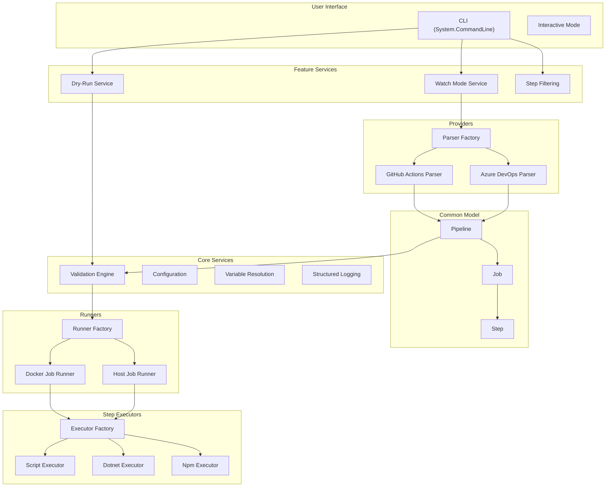
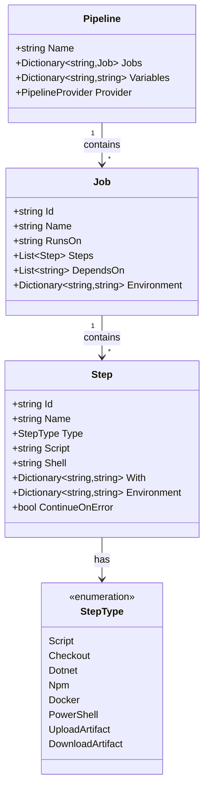
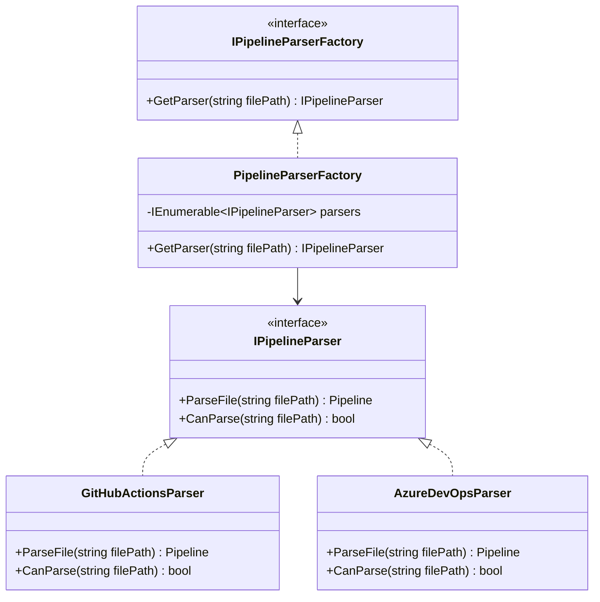
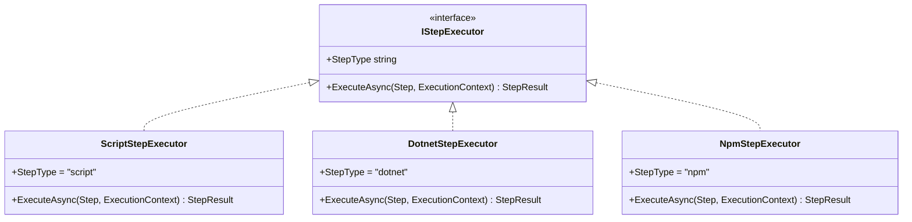
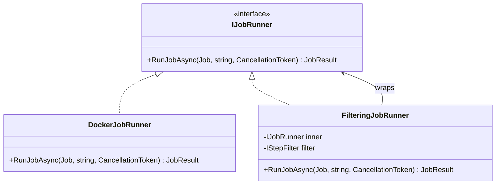
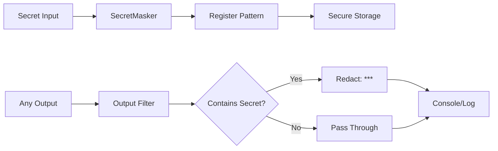

# System Overview

This document provides a comprehensive overview of PDK's architecture, layers, and technology choices.

## High-Level Architecture

PDK follows a layered architecture with clear separation of concerns:



## Layer Details

### CLI Layer (`PDK.CLI`)

The entry point for user interaction.

**Key Components:**
- `Program.cs` - Command registration and DI setup
- `Commands/` - Individual command implementations
- `WatchMode/` - File watching and auto-rerun
- `DryRun/` - Validation without execution
- `Filtering/` - Step selection UI
- `UI/` - Console output formatting

**Technologies:**
- System.CommandLine for CLI parsing
- Spectre.Console for rich terminal output
- Dependency Injection via Microsoft.Extensions.DependencyInjection

### Core Layer (`PDK.Core`)

Shared abstractions and domain models.

**Key Components:**

| Namespace | Purpose |
|-----------|---------|
| `Models/` | Pipeline, Job, Step definitions |
| `Validation/` | Validation phases and errors |
| `Logging/` | PdkLogger, CorrelationContext, SecretMasker |
| `Filtering/` | Step filter interfaces and implementations |
| `Variables/` | Variable resolution and expansion |
| `Secrets/` | Secret management and encryption |
| `Configuration/` | Configuration loading and merging |
| `Artifacts/` | Artifact upload/download |

### Provider Layer (`PDK.Providers`)

Parses provider-specific YAML into common model.

**Key Components:**

| Provider | Parser | Models |
|----------|--------|--------|
| GitHub Actions | `GitHubActionsParser` | `GitHubWorkflow`, `GitHubJob`, `GitHubStep` |
| Azure DevOps | `AzureDevOpsParser` | `AzurePipeline`, `AzureStage`, `AzureJob` |

**Responsibilities:**
- YAML deserialization
- Validation of provider-specific syntax
- Mapping to common Pipeline model
- Error handling with line numbers

### Runner Layer (`PDK.Runners`)

Executes jobs and steps.

**Key Components:**

| Component | Purpose |
|-----------|---------|
| `IJobRunner` | Interface for job execution |
| `DockerJobRunner` | Execute in Docker containers |
| `HostJobRunner` | Execute on local machine |
| `FilteringJobRunner` | Decorator for step filtering |
| `IStepExecutor` | Interface for step execution |
| `StepExecutorFactory` | Resolve executor by step type |

**Step Executors:**
- `ScriptStepExecutor` - Bash/shell scripts
- `PowerShellStepExecutor` - PowerShell scripts
- `DotnetStepExecutor` - .NET CLI commands
- `NpmStepExecutor` - npm commands
- `DockerStepExecutor` - Docker commands
- `CheckoutStepExecutor` - Git checkout
- `UploadArtifactExecutor` - Artifact upload
- `DownloadArtifactExecutor` - Artifact download

## Common Pipeline Model

The heart of PDK's provider-agnostic design:



## Dependency Injection

PDK uses Microsoft.Extensions.DependencyInjection for IoC:

```csharp
// Service registration in Program.cs
services.AddSingleton<IPipelineParser, GitHubActionsParser>();
services.AddSingleton<IPipelineParser, AzureDevOpsParser>();
services.AddSingleton<PipelineParserFactory>();

services.AddSingleton<IJobRunner, DockerJobRunner>();
services.AddSingleton<IJobRunner, HostJobRunner>();
services.AddSingleton<IRunnerFactory, RunnerFactory>();

services.AddSingleton<IStepExecutor, ScriptStepExecutor>();
services.AddSingleton<IStepExecutor, DotnetStepExecutor>();
services.AddSingleton<StepExecutorFactory>();
```

## Design Patterns Used

### Factory Pattern

Used for creating parsers, runners, and executors:



### Strategy Pattern

Used for step execution:



### Decorator Pattern

Used for filtering:



## Technology Stack Details

### .NET 8.0

- Latest LTS version
- Performance improvements
- Native AOT support (future)
- C# 12 language features

### System.CommandLine

- Declarative command definition
- Automatic help generation
- Tab completion support
- Validation and parsing

### YamlDotNet

- YAML 1.2 specification
- Custom type converters
- Error reporting with line numbers

### Docker.DotNet

- Full Docker API coverage
- Async/await support
- Container lifecycle management

### Spectre.Console

- Rich terminal output
- Progress bars and spinners
- Tables and trees
- Markup formatting

## Security Architecture

### Secret Protection



### Execution Isolation

- **Docker Mode**: Steps run in isolated containers
- **Host Mode**: Steps run with user permissions (warning shown)
- **No network access by default** (Docker)
- **Read-only filesystem mounting** (configurable)

## Performance Characteristics

| Operation | Typical Time | Notes |
|-----------|--------------|-------|
| CLI startup | ~200ms | Cold start |
| Pipeline parsing | ~50ms | Depends on file size |
| Validation | ~100ms | All phases |
| Docker container creation | ~2s | First container |
| Step execution | Varies | Depends on step |

## Next Steps

- [Parser Architecture](parsers.md) - Deep dive into parsing
- [Runner Architecture](runners.md) - Execution details
- [Data Flow](data-flow.md) - End-to-end flow
