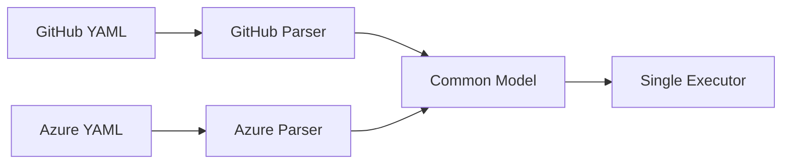

# Common Pipeline Model

## Context

PDK supports multiple CI/CD platforms (GitHub Actions, Azure DevOps), each with its own YAML format and concepts. We needed to decide how to handle this diversity internally.

## Decision

Use a common, provider-agnostic pipeline model (`Pipeline`, `Job`, `Step`) that all providers map to.



## Rationale

### 1. Single Execution Engine

With a common model, we need only one execution engine:

```csharp
// One runner works for all providers
public class DockerJobRunner : IJobRunner
{
    public Task<JobResult> RunJobAsync(Job job, ...)
    {
        // Works for GitHub, Azure, or any future provider
    }
}
```

**Benefits:**
- Less code to maintain
- Consistent execution behavior
- Easier to add new features (affects all providers)

### 2. Easier Provider Addition

Adding a new provider requires only a parser:

```csharp
public class GitLabCIParser : IPipelineParser
{
    public Pipeline Parse(string yaml)
    {
        // Map GitLab → Common model
        // Execution works automatically
    }
}
```

Without common model, adding a provider would require:
- New parser
- New executor
- New runner
- New CLI handling
- New validation

### 3. Format Conversion (Future)

A common model enables format conversion:

```bash
# Convert GitHub → Azure (future feature)
pdk convert --from github --to azure --file ci.yml
```

This requires a shared representation to translate between.

### 4. Consistent Features

Features work identically across providers:

| Feature | GitHub | Azure | GitLab |
|---------|--------|-------|--------|
| Dry-run | ✓ Same | ✓ Same | ✓ Same |
| Watch mode | ✓ Same | ✓ Same | ✓ Same |
| Filtering | ✓ Same | ✓ Same | ✓ Same |

### 5. Unified Validation

One validation system for all pipelines:

```csharp
public class DependencyValidator
{
    public IEnumerable<Error> Validate(Pipeline pipeline)
    {
        // Works for any provider
    }
}
```

## The Common Model

```csharp
public class Pipeline
{
    public string Name { get; set; }
    public Dictionary<string, Job> Jobs { get; set; }
    public Dictionary<string, string> Variables { get; set; }
    public PipelineProvider Provider { get; set; }  // Tracks source
}

public class Job
{
    public string Id { get; set; }
    public string Name { get; set; }
    public string RunsOn { get; set; }
    public List<Step> Steps { get; set; }
    public List<string> DependsOn { get; set; }
}

public class Step
{
    public string Name { get; set; }
    public StepType Type { get; set; }
    public string? Script { get; set; }
    public Dictionary<string, string> With { get; set; }
}
```

## Trade-offs

### Information Loss

Some provider-specific features don't map perfectly:

| Provider Feature | Common Model |
|-----------------|--------------|
| GitHub: `timeout-minutes` | `Job.Timeout` |
| Azure: `pool.demands` | Not mapped (logged warning) |
| GitLab: `services` | Not mapped (future) |

**Mitigation:**
- Document limitations
- Log warnings for unmapped features
- Add to common model if widely useful

### Complexity in Mapping

Parsers must handle complex mappings:

```csharp
// Azure multi-stage → flat jobs
// Stage "build" with job "compile" → job "build_compile"
var jobId = $"{stage.Name}_{job.Name}";
```

**Mitigation:**
- Well-tested parsers
- Clear mapping documentation
- Validate after mapping

### Least Common Denominator Risk

Risk of only supporting features common to all providers.

**Mitigation:**
- `StepType.Unknown` for provider-specific steps
- Extensible `With` dictionary for custom properties
- Provider field preserved for conditional logic

## Alternatives Considered

### 1. Provider-Specific Execution

Separate execution paths for each provider.

**Pros:**
- Full feature support per provider
- No mapping loss

**Cons:**
- Code duplication (3x)
- Inconsistent behavior
- Hard to add features
- Triple maintenance burden

**Verdict**: Not scalable.

### 2. AST-Based Representation

Parse YAML to abstract syntax tree, execute directly.

**Pros:**
- No information loss
- Flexible

**Cons:**
- Complex execution logic
- Must understand all formats
- Hard to validate
- No type safety

**Verdict**: Too complex.

### 3. Plugin Architecture

Each provider is a complete plugin with its own execution.

**Pros:**
- Complete flexibility
- Third-party providers

**Cons:**
- Coordination complexity
- Feature inconsistency
- Heavy plugin overhead

**Verdict**: Overkill for current scope.

## Consequences

### Positive

1. Clean separation of concerns (parsing vs execution)
2. Easy to add new providers
3. Consistent user experience
4. Simpler codebase
5. One set of tests for execution

### Negative

1. Some provider features unsupported
2. Mapping logic can be complex
3. Must maintain compatibility

### Implementation Impact

1. Need `IPipelineParser` interface
2. Need provider-specific mapper classes
3. Need `PipelineProvider` enum to track source
4. Step executors work with abstract `Step`

## Status

**Accepted** - Common model is the core of PDK's design.

## References

- [Parser Architecture](../architecture/parsers.md)
- [Runner Architecture](../architecture/runners.md)
- [Data Flow](../architecture/data-flow.md)
