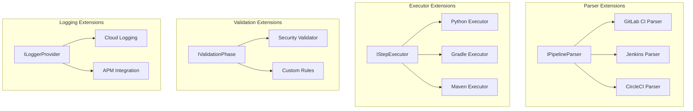

# Extending PDK

This section documents how to extend PDK with new capabilities.

## Extension Points

PDK is designed for extensibility through well-defined interfaces:



## Extension Guides

| Extension Type | Interface | Guide |
|----------------|-----------|-------|
| Pipeline Provider | `IPipelineParser` | [Custom Provider](custom-provider.md) |
| Step Executor | `IStepExecutor` | [Custom Executor](custom-executor.md) |
| Validation Rule | `IValidationPhase` | [Custom Validator](custom-validator.md) |
| Log Sink | `ILoggerProvider` | [Custom Log Sink](custom-log-sink.md) |

## When to Extend vs. Modify

### Extend When

- Adding support for a new CI/CD platform
- Adding a new step execution type
- Adding custom validation rules
- Integrating with external logging systems

### Modify Core When

- Changing fundamental behavior
- Fixing bugs in existing functionality
- Improving performance of core operations
- Adding features that affect multiple components

## Extension Development Workflow

1. **Identify the interface** - Determine which extension point to use
2. **Study existing implementations** - Look at how similar extensions work
3. **Implement the interface** - Create your extension class
4. **Register in DI** - Add to the service container
5. **Write tests** - Ensure comprehensive test coverage
6. **Document** - Add documentation for users

## General Patterns

### Interface Implementation

All extensions follow a common pattern:

```csharp
public interface IExtensionPoint
{
    // Capability check
    bool CanHandle(string identifier);

    // Main operation
    Task<Result> ExecuteAsync(Input input, CancellationToken ct);
}
```

### Registration

Extensions are registered via dependency injection:

```csharp
// In Program.cs ConfigureServices()
services.AddSingleton<IExtensionPoint, MyExtension>();
```

### Discovery

Factories discover extensions through DI:

```csharp
public class ExtensionFactory
{
    private readonly IEnumerable<IExtensionPoint> _extensions;

    public IExtensionPoint GetExtension(string identifier)
    {
        return _extensions.FirstOrDefault(e => e.CanHandle(identifier))
            ?? throw new NotSupportedException();
    }
}
```

## Testing Extensions

All extensions should have comprehensive tests:

```csharp
public class MyExtensionTests
{
    [Fact]
    public void CanHandle_SupportedInput_ReturnsTrue()
    {
        var extension = new MyExtension();
        extension.CanHandle("supported").Should().BeTrue();
    }

    [Fact]
    public async Task ExecuteAsync_ValidInput_ReturnsSuccess()
    {
        var extension = new MyExtension();
        var result = await extension.ExecuteAsync(input, CancellationToken.None);
        result.Success.Should().BeTrue();
    }
}
```

## Contributing Extensions

If your extension would benefit others:

1. Fork the repository
2. Implement the extension
3. Add tests and documentation
4. Submit a pull request

See [PR Process](../pr-process.md) for contribution guidelines.

## Next Steps

Choose the extension type you want to create:

- [Custom Provider](custom-provider.md) - Add support for a new CI/CD platform
- [Custom Executor](custom-executor.md) - Add new step execution capabilities
- [Custom Validator](custom-validator.md) - Add validation rules
- [Custom Log Sink](custom-log-sink.md) - Integrate with logging systems
