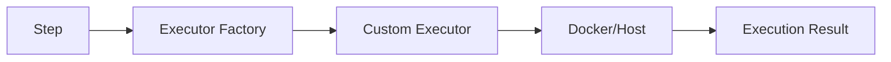

# Creating a Custom Step Executor

This guide walks through adding a new step execution type to PDK.

## Overview

A step executor handles execution of a specific step type (like `script`, `dotnet`, or `npm`). PDK uses the Strategy pattern, allowing different executors for different step types.



## Step 1: Choose the Right Interface

PDK has two executor interfaces:

| Interface | Use Case | Environment |
|-----------|----------|-------------|
| `IStepExecutor` | Docker execution | Inside container |
| `IHostStepExecutor` | Host execution | Local machine |

For full support, implement both.

## Step 2: Implement IStepExecutor

### Example: Python Executor

```csharp
// src/PDK.Runners/StepExecutors/PythonStepExecutor.cs
using PDK.Core.Models;
using PDK.Runners.Docker;

namespace PDK.Runners.StepExecutors;

public class PythonStepExecutor : IStepExecutor
{
    public string StepType => "python";

    public async Task<StepExecutionResult> ExecuteAsync(
        Step step,
        ExecutionContext context,
        CancellationToken cancellationToken)
    {
        var startTime = DateTime.UtcNow;

        try
        {
            // Validate inputs
            var script = step.Script
                ?? throw new ArgumentException("Python step requires script content");

            // Determine Python version
            var pythonCmd = step.With.TryGetValue("python-version", out var version)
                ? $"python{version}"
                : "python3";

            // Create temp script file
            var scriptPath = $"/tmp/pdk-python-{Guid.NewGuid()}.py";

            // Write script to container
            await WriteScriptToContainerAsync(
                context,
                scriptPath,
                script,
                cancellationToken);

            // Make executable
            await context.ContainerManager.ExecuteCommandAsync(
                context.ContainerId,
                $"chmod +x {scriptPath}",
                cancellationToken);

            // Build command
            var command = BuildCommand(pythonCmd, scriptPath, step);

            // Merge environment
            var environment = MergeEnvironment(context.Environment, step.Environment);

            // Execute
            var result = await context.ContainerManager.ExecuteCommandAsync(
                context.ContainerId,
                command,
                environment,
                context.WorkingDirectory,
                cancellationToken);

            // Cleanup
            await context.ContainerManager.ExecuteCommandAsync(
                context.ContainerId,
                $"rm -f {scriptPath}",
                cancellationToken);

            var endTime = DateTime.UtcNow;

            return new StepExecutionResult
            {
                StepName = step.Name,
                Success = result.ExitCode == 0,
                ExitCode = result.ExitCode,
                Output = result.Output,
                ErrorOutput = result.ErrorOutput,
                StartTime = startTime,
                EndTime = endTime,
                Duration = endTime - startTime
            };
        }
        catch (Exception ex)
        {
            return new StepExecutionResult
            {
                StepName = step.Name,
                Success = false,
                ExitCode = -1,
                Output = "",
                ErrorOutput = ex.Message,
                StartTime = startTime,
                EndTime = DateTime.UtcNow,
                Duration = DateTime.UtcNow - startTime
            };
        }
    }

    private async Task WriteScriptToContainerAsync(
        ExecutionContext context,
        string path,
        string content,
        CancellationToken ct)
    {
        // Use heredoc to write script with proper handling
        var escapedContent = content.Replace("'", "'\\''");
        var writeCommand = $"cat > {path} << 'PDKEOF'\n{content}\nPDKEOF";

        await context.ContainerManager.ExecuteCommandAsync(
            context.ContainerId,
            writeCommand,
            ct);
    }

    private string BuildCommand(string pythonCmd, string scriptPath, Step step)
    {
        var args = new List<string> { pythonCmd, scriptPath };

        // Add any additional arguments
        if (step.With.TryGetValue("args", out var stepArgs))
        {
            args.Add(stepArgs);
        }

        return string.Join(" ", args);
    }

    private Dictionary<string, string> MergeEnvironment(
        Dictionary<string, string> context,
        Dictionary<string, string>? step)
    {
        var result = new Dictionary<string, string>(context);

        if (step != null)
        {
            foreach (var (key, value) in step)
            {
                result[key] = value;
            }
        }

        return result;
    }
}
```

## Step 3: Implement IHostStepExecutor

For host-mode support:

```csharp
// src/PDK.Runners/StepExecutors/HostPythonExecutor.cs
namespace PDK.Runners.StepExecutors;

public class HostPythonExecutor : IHostStepExecutor
{
    public string StepType => "python";

    public async Task<StepExecutionResult> ExecuteAsync(
        Step step,
        HostExecutionContext context,
        CancellationToken cancellationToken)
    {
        var startTime = DateTime.UtcNow;

        try
        {
            var script = step.Script
                ?? throw new ArgumentException("Python step requires script");

            // Determine Python command based on platform
            var pythonCmd = context.Platform == OSPlatform.Windows
                ? "python"
                : "python3";

            // Check if Python is available
            if (!await context.ProcessExecutor.IsToolAvailableAsync(pythonCmd))
            {
                throw new ToolNotFoundException($"{pythonCmd} not found on PATH");
            }

            // Create temp script file
            var extension = ".py";
            var scriptPath = Path.Combine(
                Path.GetTempPath(),
                $"pdk-python-{Guid.NewGuid()}{extension}");

            await File.WriteAllTextAsync(scriptPath, script, cancellationToken);

            try
            {
                // Build command
                var args = scriptPath;
                if (step.With.TryGetValue("args", out var stepArgs))
                {
                    args += $" {stepArgs}";
                }

                // Execute
                var result = await context.ProcessExecutor.ExecuteAsync(
                    pythonCmd,
                    args,
                    context.ResolvePath(step.WorkingDirectory ?? "."),
                    MergeEnvironment(context.Environment, step.Environment),
                    cancellationToken);

                var endTime = DateTime.UtcNow;

                return new StepExecutionResult
                {
                    StepName = step.Name,
                    Success = result.ExitCode == 0,
                    ExitCode = result.ExitCode,
                    Output = result.Output,
                    ErrorOutput = result.ErrorOutput,
                    StartTime = startTime,
                    EndTime = endTime,
                    Duration = endTime - startTime
                };
            }
            finally
            {
                // Cleanup temp file
                if (File.Exists(scriptPath))
                    File.Delete(scriptPath);
            }
        }
        catch (Exception ex)
        {
            return new StepExecutionResult
            {
                StepName = step.Name,
                Success = false,
                ExitCode = -1,
                ErrorOutput = ex.Message,
                StartTime = startTime,
                EndTime = DateTime.UtcNow,
                Duration = DateTime.UtcNow - startTime
            };
        }
    }

    private Dictionary<string, string> MergeEnvironment(
        Dictionary<string, string> context,
        Dictionary<string, string>? step)
    {
        var result = new Dictionary<string, string>(context);
        if (step != null)
        {
            foreach (var (key, value) in step)
                result[key] = value;
        }
        return result;
    }
}
```

## Step 4: Register in DI

Add both executors to the service container:

```csharp
// In src/PDK.CLI/Program.cs ConfigureServices()

// Docker step executors
services.AddSingleton<IStepExecutor, ScriptStepExecutor>();
services.AddSingleton<IStepExecutor, DotnetStepExecutor>();
services.AddSingleton<IStepExecutor, PythonStepExecutor>();  // Add this

// Host step executors
services.AddSingleton<IHostStepExecutor, HostScriptExecutor>();
services.AddSingleton<IHostStepExecutor, HostDotnetExecutor>();
services.AddSingleton<IHostStepExecutor, HostPythonExecutor>();  // Add this
```

## Step 5: Update Parser Mapping

If the step type comes from a specific action/task, update the mapper:

```csharp
// In ActionMapper or AzureStepMapper
public StepType MapAction(string uses)
{
    return uses switch
    {
        var u when u.StartsWith("actions/setup-python") => StepType.Python,
        // ... other mappings
    };
}
```

Or add to the `StepType` enum:

```csharp
// In PDK.Core/Models/StepType.cs
public enum StepType
{
    Unknown,
    Script,
    Checkout,
    Dotnet,
    Npm,
    Docker,
    PowerShell,
    Python,  // Add this
    // ...
}
```

## Step 6: Write Tests

### Unit Tests

```csharp
// tests/PDK.Tests.Unit/StepExecutors/PythonStepExecutorTests.cs
namespace PDK.Tests.Unit.StepExecutors;

public class PythonStepExecutorTests
{
    private readonly Mock<IContainerManager> _containerManager;
    private readonly PythonStepExecutor _executor;

    public PythonStepExecutorTests()
    {
        _containerManager = new Mock<IContainerManager>();
        _executor = new PythonStepExecutor();
    }

    [Fact]
    public void StepType_ReturnsPython()
    {
        _executor.StepType.Should().Be("python");
    }

    [Fact]
    public async Task ExecuteAsync_ValidScript_ReturnsSuccess()
    {
        // Arrange
        var step = new Step
        {
            Name = "Run Python",
            Script = "print('Hello')"
        };

        _containerManager
            .Setup(x => x.ExecuteCommandAsync(
                It.IsAny<string>(),
                It.IsAny<string>(),
                It.IsAny<CancellationToken>()))
            .ReturnsAsync(new CommandResult { ExitCode = 0, Output = "Hello" });

        var context = CreateContext();

        // Act
        var result = await _executor.ExecuteAsync(step, context, CancellationToken.None);

        // Assert
        result.Success.Should().BeTrue();
    }

    [Fact]
    public async Task ExecuteAsync_NoScript_ThrowsArgumentException()
    {
        var step = new Step { Name = "Empty" };
        var context = CreateContext();

        var result = await _executor.ExecuteAsync(step, context, CancellationToken.None);

        result.Success.Should().BeFalse();
        result.ErrorOutput.Should().Contain("script");
    }

    [Fact]
    public async Task ExecuteAsync_WithPythonVersion_UsesSpecifiedVersion()
    {
        var step = new Step
        {
            Name = "Python 3.11",
            Script = "import sys; print(sys.version)",
            With = new Dictionary<string, string> { ["python-version"] = "3.11" }
        };

        _containerManager
            .Setup(x => x.ExecuteCommandAsync(
                It.IsAny<string>(),
                It.Is<string>(cmd => cmd.Contains("python3.11")),
                It.IsAny<CancellationToken>()))
            .ReturnsAsync(new CommandResult { ExitCode = 0 });

        var context = CreateContext();

        await _executor.ExecuteAsync(step, context, CancellationToken.None);

        _containerManager.Verify(x => x.ExecuteCommandAsync(
            It.IsAny<string>(),
            It.Is<string>(cmd => cmd.Contains("python3.11")),
            It.IsAny<CancellationToken>()));
    }

    private ExecutionContext CreateContext()
    {
        return new ExecutionContext(
            ContainerId: "test-container",
            ContainerManager: _containerManager.Object,
            WorkspacePath: "/workspace",
            ContainerWorkspacePath: "/workspace",
            Environment: new Dictionary<string, string>(),
            WorkingDirectory: null,
            JobInfo: new JobMetadata("test-job", "test"),
            ArtifactContext: null);
    }
}
```

### Integration Tests

```csharp
[Trait("Category", "Integration")]
public class PythonExecutorIntegrationTests
{
    [Fact]
    public async Task ExecuteAsync_RealPythonScript_Succeeds()
    {
        // This test requires Docker
        var containerManager = new DockerContainerManager();
        var executor = new PythonStepExecutor();

        var containerId = await containerManager.CreateContainerAsync(
            new ContainerConfig { Image = "python:3.11-slim" });

        try
        {
            var step = new Step
            {
                Name = "Test Python",
                Script = "print('Hello from Python')"
            };

            var context = new ExecutionContext(
                ContainerId: containerId,
                ContainerManager: containerManager,
                // ... other fields
            );

            var result = await executor.ExecuteAsync(
                step, context, CancellationToken.None);

            result.Success.Should().BeTrue();
            result.Output.Should().Contain("Hello from Python");
        }
        finally
        {
            await containerManager.RemoveContainerAsync(containerId);
        }
    }
}
```

## Step 7: Document

Add user documentation:

```markdown
# Python Steps

PDK supports Python script execution.

## Usage

```yaml
steps:
  - name: Run Python script
    uses: actions/setup-python@v4
    with:
      python-version: '3.11'

  - name: Execute script
    run: |
      import json
      data = {"key": "value"}
      print(json.dumps(data))
    shell: python
```

## Options

| Option | Description | Default |
|--------|-------------|---------|
| `python-version` | Python version | `3` |
| `args` | Additional arguments | None |

## Examples

### Simple Script

```yaml
- name: Hello World
  run: print("Hello, World!")
  shell: python
```

### With Dependencies

```yaml
- name: Install dependencies
  run: pip install requests

- name: Use library
  run: |
    import requests
    response = requests.get('https://api.example.com')
    print(response.status_code)
  shell: python
```
```

## Best Practices

### Error Handling

Always return a result, even on exceptions:

```csharp
try
{
    // ... execution logic
}
catch (Exception ex)
{
    return new StepExecutionResult
    {
        Success = false,
        ErrorOutput = ex.Message
    };
}
```

### Tool Availability

Check tool availability before execution:

```csharp
if (!await context.ProcessExecutor.IsToolAvailableAsync("python3"))
{
    throw new ToolNotFoundException("Python is not installed");
}
```

### Cleanup

Always clean up temporary files:

```csharp
try
{
    // ... use temp file
}
finally
{
    if (File.Exists(tempPath))
        File.Delete(tempPath);
}
```

## Next Steps

- [Custom Provider](custom-provider.md) - Add new CI platforms
- [Custom Validator](custom-validator.md) - Add validation rules
- [Runner Architecture](../architecture/runners.md) - Executor internals
