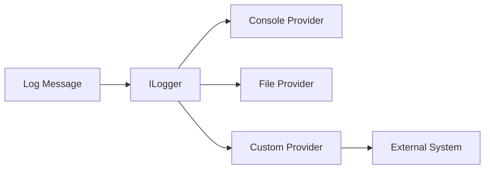

# Creating a Custom Log Sink

This guide walks through integrating PDK with external logging systems.

## Overview

PDK uses Microsoft.Extensions.Logging, making it easy to add custom log destinations (sinks).



## Step 1: Implement ILoggerProvider

```csharp
// src/PDK.Core/Logging/Sinks/CloudLoggerProvider.cs
using Microsoft.Extensions.Logging;

namespace PDK.Core.Logging.Sinks;

public class CloudLoggerProvider : ILoggerProvider
{
    private readonly CloudLoggerOptions _options;
    private readonly ConcurrentDictionary<string, CloudLogger> _loggers = new();

    public CloudLoggerProvider(CloudLoggerOptions options)
    {
        _options = options;
    }

    public ILogger CreateLogger(string categoryName)
    {
        return _loggers.GetOrAdd(categoryName, name =>
            new CloudLogger(name, _options));
    }

    public void Dispose()
    {
        _loggers.Clear();
    }
}

public class CloudLoggerOptions
{
    public string Endpoint { get; set; } = "";
    public string ApiKey { get; set; } = "";
    public LogLevel MinimumLevel { get; set; } = LogLevel.Information;
    public string ApplicationName { get; set; } = "PDK";
    public int BatchSize { get; set; } = 100;
    public TimeSpan FlushInterval { get; set; } = TimeSpan.FromSeconds(5);
}
```

## Step 2: Implement ILogger

```csharp
// src/PDK.Core/Logging/Sinks/CloudLogger.cs
using Microsoft.Extensions.Logging;
using System.Collections.Concurrent;

namespace PDK.Core.Logging.Sinks;

public class CloudLogger : ILogger
{
    private readonly string _categoryName;
    private readonly CloudLoggerOptions _options;
    private readonly HttpClient _httpClient;
    private readonly ConcurrentQueue<LogEntry> _buffer = new();
    private readonly Timer _flushTimer;

    public CloudLogger(string categoryName, CloudLoggerOptions options)
    {
        _categoryName = categoryName;
        _options = options;
        _httpClient = new HttpClient();
        _httpClient.DefaultRequestHeaders.Add("X-API-Key", options.ApiKey);

        _flushTimer = new Timer(
            _ => FlushAsync().Wait(),
            null,
            options.FlushInterval,
            options.FlushInterval);
    }

    public IDisposable? BeginScope<TState>(TState state) where TState : notnull
    {
        return null; // Or implement scope tracking
    }

    public bool IsEnabled(LogLevel logLevel)
    {
        return logLevel >= _options.MinimumLevel;
    }

    public void Log<TState>(
        LogLevel logLevel,
        EventId eventId,
        TState state,
        Exception? exception,
        Func<TState, Exception?, string> formatter)
    {
        if (!IsEnabled(logLevel))
            return;

        var entry = new LogEntry
        {
            Timestamp = DateTime.UtcNow,
            Level = logLevel.ToString(),
            Category = _categoryName,
            Message = formatter(state, exception),
            CorrelationId = CorrelationContext.CurrentId,
            Exception = exception?.ToString(),
            Application = _options.ApplicationName
        };

        _buffer.Enqueue(entry);

        if (_buffer.Count >= _options.BatchSize)
        {
            _ = FlushAsync(); // Fire and forget
        }
    }

    private async Task FlushAsync()
    {
        if (_buffer.IsEmpty)
            return;

        var entries = new List<LogEntry>();
        while (_buffer.TryDequeue(out var entry))
        {
            entries.Add(entry);
            if (entries.Count >= _options.BatchSize)
                break;
        }

        if (entries.Count == 0)
            return;

        try
        {
            var json = JsonSerializer.Serialize(entries);
            var content = new StringContent(json, Encoding.UTF8, "application/json");
            await _httpClient.PostAsync(_options.Endpoint, content);
        }
        catch (Exception ex)
        {
            // Log to console as fallback
            Console.Error.WriteLine($"Failed to send logs: {ex.Message}");
        }
    }

    private class LogEntry
    {
        public DateTime Timestamp { get; set; }
        public string Level { get; set; } = "";
        public string Category { get; set; } = "";
        public string Message { get; set; } = "";
        public string? CorrelationId { get; set; }
        public string? Exception { get; set; }
        public string Application { get; set; } = "";
    }
}
```

## Step 3: Create Extension Method

```csharp
// src/PDK.Core/Logging/Sinks/CloudLoggerExtensions.cs
using Microsoft.Extensions.Logging;

namespace PDK.Core.Logging.Sinks;

public static class CloudLoggerExtensions
{
    public static ILoggingBuilder AddCloudLogger(
        this ILoggingBuilder builder,
        Action<CloudLoggerOptions> configure)
    {
        var options = new CloudLoggerOptions();
        configure(options);

        builder.AddProvider(new CloudLoggerProvider(options));
        return builder;
    }

    public static ILoggingBuilder AddCloudLogger(
        this ILoggingBuilder builder,
        CloudLoggerOptions options)
    {
        builder.AddProvider(new CloudLoggerProvider(options));
        return builder;
    }
}
```

## Step 4: Register in DI

```csharp
// In src/PDK.CLI/Program.cs

services.AddLogging(builder =>
{
    builder.ConfigurePdkLogging();

    // Add custom cloud logger
    builder.AddCloudLogger(options =>
    {
        options.Endpoint = "https://logs.example.com/api/logs";
        options.ApiKey = Environment.GetEnvironmentVariable("LOG_API_KEY") ?? "";
        options.MinimumLevel = LogLevel.Information;
        options.ApplicationName = "PDK";
    });
});
```

## Step 5: Configuration Support

Add configuration file support:

```csharp
// Read from configuration
var config = await configLoader.LoadAsync();
if (config?.Logging?.CloudEndpoint != null)
{
    builder.AddCloudLogger(options =>
    {
        options.Endpoint = config.Logging.CloudEndpoint;
        options.ApiKey = config.Logging.CloudApiKey ?? "";
    });
}
```

Configuration file:

```yaml
# .pdkrc
logging:
  cloudEndpoint: https://logs.example.com/api/logs
  cloudApiKey: ${LOG_API_KEY}
```

## Example: Elasticsearch Sink

```csharp
public class ElasticsearchLoggerProvider : ILoggerProvider
{
    private readonly ElasticsearchOptions _options;

    public ElasticsearchLoggerProvider(ElasticsearchOptions options)
    {
        _options = options;
    }

    public ILogger CreateLogger(string categoryName)
    {
        return new ElasticsearchLogger(categoryName, _options);
    }

    public void Dispose() { }
}

public class ElasticsearchLogger : ILogger
{
    private readonly string _category;
    private readonly ElasticsearchOptions _options;
    private readonly HttpClient _client;

    public ElasticsearchLogger(string category, ElasticsearchOptions options)
    {
        _category = category;
        _options = options;
        _client = new HttpClient { BaseAddress = new Uri(options.Url) };
    }

    public void Log<TState>(
        LogLevel logLevel,
        EventId eventId,
        TState state,
        Exception? exception,
        Func<TState, Exception?, string> formatter)
    {
        if (!IsEnabled(logLevel))
            return;

        var document = new
        {
            @timestamp = DateTime.UtcNow.ToString("o"),
            level = logLevel.ToString().ToLower(),
            category = _category,
            message = formatter(state, exception),
            correlationId = CorrelationContext.CurrentId,
            exception = exception?.ToString(),
            host = Environment.MachineName,
            application = "pdk"
        };

        var index = $"pdk-logs-{DateTime.UtcNow:yyyy.MM.dd}";
        var json = JsonSerializer.Serialize(document);

        // Fire and forget (consider batching in production)
        _ = _client.PostAsync(
            $"/{index}/_doc",
            new StringContent(json, Encoding.UTF8, "application/json"));
    }

    public bool IsEnabled(LogLevel logLevel) => logLevel >= _options.MinimumLevel;
    public IDisposable? BeginScope<TState>(TState state) => null;
}
```

## Example: Application Insights

```csharp
public static class ApplicationInsightsExtensions
{
    public static ILoggingBuilder AddApplicationInsights(
        this ILoggingBuilder builder,
        string connectionString)
    {
        // Use the official Application Insights package
        builder.AddApplicationInsights(
            configureTelemetryConfiguration: config =>
            {
                config.ConnectionString = connectionString;
            },
            configureApplicationInsightsLoggerOptions: options => { });

        return builder;
    }
}
```

## Step 6: Write Tests

```csharp
public class CloudLoggerTests
{
    [Fact]
    public void Log_InfoLevel_AddsToBuffer()
    {
        var options = new CloudLoggerOptions
        {
            Endpoint = "https://test.example.com",
            MinimumLevel = LogLevel.Information
        };

        var logger = new CloudLogger("TestCategory", options);

        logger.LogInformation("Test message");

        // Verify buffer contains message
        // (Requires exposing buffer or using reflection for testing)
    }

    [Fact]
    public void IsEnabled_BelowMinimum_ReturnsFalse()
    {
        var options = new CloudLoggerOptions
        {
            MinimumLevel = LogLevel.Warning
        };

        var logger = new CloudLogger("TestCategory", options);

        logger.IsEnabled(LogLevel.Information).Should().BeFalse();
        logger.IsEnabled(LogLevel.Warning).Should().BeTrue();
    }

    [Fact]
    public async Task FlushAsync_SendsToEndpoint()
    {
        var handler = new MockHttpMessageHandler();
        var options = new CloudLoggerOptions
        {
            Endpoint = "https://test.example.com/logs"
        };

        var logger = new CloudLoggerWithMockHttp("Test", options, handler);
        logger.LogInformation("Test");

        await logger.FlushAsync();

        handler.Requests.Should().ContainSingle();
    }
}
```

## Best Practices

### Buffering

Always buffer logs and send in batches:

```csharp
private readonly ConcurrentQueue<LogEntry> _buffer = new();
private readonly int _batchSize = 100;

public void Log<TState>(...)
{
    _buffer.Enqueue(entry);

    if (_buffer.Count >= _batchSize)
    {
        _ = FlushAsync();
    }
}
```

### Async Sending

Don't block logging calls:

```csharp
// Good - Fire and forget
_ = SendAsync(entries);

// Bad - Blocks caller
SendAsync(entries).Wait();
```

### Failure Handling

Handle send failures gracefully:

```csharp
try
{
    await _httpClient.PostAsync(endpoint, content);
}
catch (Exception ex)
{
    // Fallback to console
    Console.Error.WriteLine($"Log send failed: {ex.Message}");

    // Optionally retry or persist locally
    await PersistLocallyAsync(entries);
}
```

### Secret Protection

Mask secrets before sending:

```csharp
public void Log<TState>(...)
{
    var message = formatter(state, exception);
    var maskedMessage = _secretMasker.Mask(message);

    // Send masked message
}
```

## Next Steps

- [Logging Architecture](../architecture/logging.md) - Logging internals
- [Configuration](../architecture/configuration.md) - Configuration system
- [PR Process](../pr-process.md) - Contributing your sink
