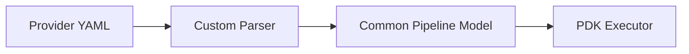

# Creating a Custom Pipeline Provider

This guide walks through adding support for a new CI/CD platform to PDK.

## Overview

A pipeline provider parses platform-specific YAML files (like `.gitlab-ci.yml` or `Jenkinsfile`) and converts them to PDK's common pipeline model.



## Step 1: Create Provider-Specific Models

First, create C# classes that match the provider's YAML structure.

### Example: GitLab CI Models

Create a new folder: `src/PDK.Providers/GitLab/Models/`

```csharp
// src/PDK.Providers/GitLab/Models/GitLabPipeline.cs
namespace PDK.Providers.GitLab.Models;

public class GitLabPipeline
{
    public List<string>? Stages { get; set; }
    public Dictionary<string, GitLabJob>? Jobs { get; set; }
    public Dictionary<string, string>? Variables { get; set; }
    public GitLabDefault? Default { get; set; }
}

public class GitLabDefault
{
    public string? Image { get; set; }
    public List<string>? BeforeScript { get; set; }
    public List<string>? AfterScript { get; set; }
}
```

```csharp
// src/PDK.Providers/GitLab/Models/GitLabJob.cs
namespace PDK.Providers.GitLab.Models;

public class GitLabJob
{
    public string? Stage { get; set; }
    public string? Image { get; set; }
    public List<string>? Script { get; set; }
    public List<string>? BeforeScript { get; set; }
    public List<string>? AfterScript { get; set; }
    public List<string>? Needs { get; set; }
    public Dictionary<string, string>? Variables { get; set; }
    public bool? AllowFailure { get; set; }
    public GitLabRules? Rules { get; set; }
    public GitLabArtifacts? Artifacts { get; set; }
}
```

## Step 2: Implement IPipelineParser

Create the parser class that implements `IPipelineParser`:

```csharp
// src/PDK.Providers/GitLab/GitLabCIParser.cs
using YamlDotNet.Serialization;
using YamlDotNet.Serialization.NamingConventions;
using PDK.Core.Models;
using PDK.Providers.GitLab.Models;

namespace PDK.Providers.GitLab;

public class GitLabCIParser : IPipelineParser
{
    private readonly IDeserializer _deserializer;

    public GitLabCIParser()
    {
        _deserializer = new DeserializerBuilder()
            .WithNamingConvention(UnderscoredNamingConvention.Instance)
            .IgnoreUnmatchedProperties()
            .Build();
    }

    public bool CanParse(string filePath)
    {
        var fileName = Path.GetFileName(filePath);
        return fileName.Equals(".gitlab-ci.yml", StringComparison.OrdinalIgnoreCase)
            || fileName.Equals(".gitlab-ci.yaml", StringComparison.OrdinalIgnoreCase);
    }

    public Pipeline Parse(string yamlContent)
    {
        var gitlabPipeline = _deserializer.Deserialize<GitLabPipeline>(yamlContent);
        return MapToPipeline(gitlabPipeline);
    }

    public async Task<Pipeline> ParseFile(string filePath)
    {
        var content = await File.ReadAllTextAsync(filePath);
        var pipeline = Parse(content);
        pipeline.Name = Path.GetFileNameWithoutExtension(filePath);
        return pipeline;
    }

    private Pipeline MapToPipeline(GitLabPipeline gitlabPipeline)
    {
        var pipeline = new Pipeline
        {
            Name = "gitlab-ci",
            Provider = PipelineProvider.GitLab,
            Jobs = new Dictionary<string, Job>(),
            Variables = gitlabPipeline.Variables ?? new()
        };

        if (gitlabPipeline.Jobs == null)
            return pipeline;

        foreach (var (jobName, gitlabJob) in gitlabPipeline.Jobs)
        {
            // Skip special keywords
            if (IsSpecialKeyword(jobName))
                continue;

            var job = MapJob(jobName, gitlabJob, gitlabPipeline.Default);
            pipeline.Jobs[jobName] = job;
        }

        return pipeline;
    }

    private Job MapJob(string name, GitLabJob gitlabJob, GitLabDefault? defaults)
    {
        var job = new Job
        {
            Id = name,
            Name = name,
            RunsOn = gitlabJob.Image ?? defaults?.Image ?? "alpine:latest",
            Steps = new List<Step>(),
            DependsOn = gitlabJob.Needs ?? new List<string>(),
            Environment = gitlabJob.Variables ?? new Dictionary<string, string>()
        };

        // Map before_script
        var beforeScript = gitlabJob.BeforeScript ?? defaults?.BeforeScript;
        if (beforeScript != null)
        {
            foreach (var script in beforeScript)
            {
                job.Steps.Add(CreateScriptStep($"before: {TruncateName(script)}", script));
            }
        }

        // Map script
        if (gitlabJob.Script != null)
        {
            foreach (var script in gitlabJob.Script)
            {
                job.Steps.Add(CreateScriptStep(TruncateName(script), script));
            }
        }

        // Map after_script
        var afterScript = gitlabJob.AfterScript ?? defaults?.AfterScript;
        if (afterScript != null)
        {
            foreach (var script in afterScript)
            {
                var step = CreateScriptStep($"after: {TruncateName(script)}", script);
                step.ContinueOnError = true; // after_script always runs
                job.Steps.Add(step);
            }
        }

        return job;
    }

    private Step CreateScriptStep(string name, string script)
    {
        return new Step
        {
            Name = name,
            Type = StepType.Script,
            Script = script,
            Shell = "bash"
        };
    }

    private string TruncateName(string script)
    {
        var firstLine = script.Split('\n')[0];
        return firstLine.Length > 50 ? firstLine[..47] + "..." : firstLine;
    }

    private bool IsSpecialKeyword(string name)
    {
        return name is "stages" or "variables" or "default" or "workflow"
            or "include" or "image" or "services" or "cache";
    }
}
```

## Step 3: Add Validation

Add validation logic to catch errors early:

```csharp
private void Validate(GitLabPipeline pipeline, string filePath)
{
    var errors = new List<string>();

    // Check for jobs
    if (pipeline.Jobs == null || !pipeline.Jobs.Any())
    {
        errors.Add("Pipeline has no jobs defined");
    }

    // Check each job has script
    if (pipeline.Jobs != null)
    {
        foreach (var (name, job) in pipeline.Jobs)
        {
            if (IsSpecialKeyword(name)) continue;

            if (job.Script == null || !job.Script.Any())
            {
                errors.Add($"Job '{name}' has no script defined");
            }
        }
    }

    // Validate dependencies exist
    if (pipeline.Jobs != null)
    {
        foreach (var (name, job) in pipeline.Jobs)
        {
            if (job.Needs == null) continue;

            foreach (var dep in job.Needs)
            {
                if (!pipeline.Jobs.ContainsKey(dep))
                {
                    errors.Add($"Job '{name}' depends on unknown job '{dep}'");
                }
            }
        }
    }

    if (errors.Any())
    {
        throw new PipelineParseException(
            $"Validation failed:\n{string.Join("\n", errors.Select(e => $"  - {e}"))}",
            filePath);
    }
}
```

## Step 4: Register in DI

Add the parser to the service container:

```csharp
// In src/PDK.CLI/Program.cs ConfigureServices()

// Register parsers
services.AddSingleton<IPipelineParser, GitHubActionsParser>();
services.AddSingleton<IPipelineParser, AzureDevOpsParser>();
services.AddSingleton<IPipelineParser, GitLabCIParser>();  // Add this line
```

## Step 5: Write Tests

Create comprehensive tests:

```csharp
// tests/PDK.Tests.Unit/Providers/GitLabCIParserTests.cs
namespace PDK.Tests.Unit.Providers;

public class GitLabCIParserTests
{
    private readonly GitLabCIParser _parser = new();

    [Fact]
    public void CanParse_GitLabCIFile_ReturnsTrue()
    {
        _parser.CanParse(".gitlab-ci.yml").Should().BeTrue();
        _parser.CanParse(".gitlab-ci.yaml").Should().BeTrue();
    }

    [Fact]
    public void CanParse_OtherFile_ReturnsFalse()
    {
        _parser.CanParse("azure-pipelines.yml").Should().BeFalse();
        _parser.CanParse("ci.yml").Should().BeFalse();
    }

    [Fact]
    public void Parse_SimpleJob_ParsesCorrectly()
    {
        var yaml = """
            build:
              script:
                - dotnet build
            """;

        var pipeline = _parser.Parse(yaml);

        pipeline.Jobs.Should().HaveCount(1);
        pipeline.Jobs["build"].Steps.Should().HaveCount(1);
        pipeline.Jobs["build"].Steps[0].Script.Should().Be("dotnet build");
    }

    [Fact]
    public void Parse_WithBeforeScript_AddsBeforeSteps()
    {
        var yaml = """
            build:
              before_script:
                - echo "Setup"
              script:
                - dotnet build
            """;

        var pipeline = _parser.Parse(yaml);

        pipeline.Jobs["build"].Steps.Should().HaveCount(2);
        pipeline.Jobs["build"].Steps[0].Name.Should().StartWith("before:");
    }

    [Fact]
    public void Parse_WithNeeds_SetsDependencies()
    {
        var yaml = """
            build:
              script:
                - dotnet build
            test:
              script:
                - dotnet test
              needs:
                - build
            """;

        var pipeline = _parser.Parse(yaml);

        pipeline.Jobs["test"].DependsOn.Should().Contain("build");
    }

    [Fact]
    public void Parse_WithImage_SetsRunsOn()
    {
        var yaml = """
            build:
              image: mcr.microsoft.com/dotnet/sdk:8.0
              script:
                - dotnet build
            """;

        var pipeline = _parser.Parse(yaml);

        pipeline.Jobs["build"].RunsOn.Should().Be("mcr.microsoft.com/dotnet/sdk:8.0");
    }

    [Fact]
    public void Parse_InvalidDependency_ThrowsException()
    {
        var yaml = """
            test:
              script:
                - dotnet test
              needs:
                - nonexistent
            """;

        var act = () => _parser.Parse(yaml);

        act.Should().Throw<PipelineParseException>()
            .WithMessage("*nonexistent*");
    }
}
```

## Step 6: Document

Add user documentation:

```markdown
# GitLab CI Support

PDK supports GitLab CI pipelines (`.gitlab-ci.yml`).

## Supported Features

- Basic jobs with script
- before_script and after_script
- Job dependencies (needs)
- Custom images
- Variables

## Limitations

- Services are not yet supported
- Cache configuration is ignored
- include directives are not expanded

## Example

```yaml
build:
  image: node:18
  script:
    - npm install
    - npm run build
  artifacts:
    paths:
      - dist/

test:
  image: node:18
  script:
    - npm test
  needs:
    - build
```

Run with PDK:

```bash
pdk run --file .gitlab-ci.yml
```
```

## Common Challenges

### Different Terminology

Map provider concepts to PDK concepts:

| GitLab | GitHub | Azure | PDK |
|--------|--------|-------|-----|
| job | job | job | Job |
| script | run | script | Step.Script |
| image | runs-on (container) | pool.vmImage | Job.RunsOn |
| needs | needs | dependsOn | Job.DependsOn |

### Variable Syntax

Convert provider-specific variable syntax:

```csharp
// GitLab: $VARIABLE or ${VARIABLE}
// PDK: ${VARIABLE}
private string ConvertVariables(string text)
{
    // Convert $VAR to ${VAR}
    return Regex.Replace(text, @"\$(\w+)", "${$1}");
}
```

### Unsupported Features

Document and handle unsupported features gracefully:

```csharp
if (job.Services != null && job.Services.Any())
{
    _logger.LogWarning(
        "Job '{Job}' uses services, which are not yet supported. " +
        "Services will be ignored.",
        jobName);
}
```

## Next Steps

- [Custom Executor](custom-executor.md) - Add step execution types
- [Parser Architecture](../architecture/parsers.md) - Parser internals
- [PR Process](../pr-process.md) - Contributing your parser
