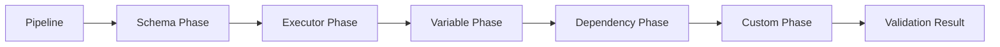

# Creating a Custom Validator

This guide walks through adding custom validation rules to PDK's dry-run system.

## Overview

Validators check pipelines for issues before execution. PDK's validation system uses phases, each checking different aspects of the pipeline.



## Built-in Validation Phases

| Phase | Purpose |
|-------|---------|
| Schema | YAML structure, required fields |
| Executor | Step executors exist |
| Variable | Variable references resolvable |
| Dependency | No circular dependencies |

## Step 1: Implement IValidationPhase

```csharp
// src/PDK.Core/Validation/Phases/SecurityValidationPhase.cs
using PDK.Core.Models;
using PDK.Core.Validation;

namespace PDK.Core.Validation.Phases;

public class SecurityValidationPhase : IValidationPhase
{
    public string Name => "Security";
    public int Order => 50;  // After built-in phases (10-40)

    public Task<IEnumerable<DryRunValidationError>> ValidateAsync(
        Pipeline pipeline,
        ValidationContext context,
        CancellationToken cancellationToken)
    {
        var errors = new List<DryRunValidationError>();

        foreach (var job in pipeline.Jobs.Values)
        {
            foreach (var step in job.Steps)
            {
                // Check for hardcoded secrets
                ValidateNoHardcodedSecrets(step, job, errors);

                // Check for dangerous commands
                ValidateSafeCommands(step, job, errors);

                // Check for privilege escalation
                ValidateNoPrivilegeEscalation(step, job, errors);
            }
        }

        return Task.FromResult<IEnumerable<DryRunValidationError>>(errors);
    }

    private void ValidateNoHardcodedSecrets(
        Step step,
        Job job,
        List<DryRunValidationError> errors)
    {
        var patterns = new[]
        {
            @"password\s*=\s*['""][^'""]+['""]",
            @"api[_-]?key\s*=\s*['""][^'""]+['""]",
            @"secret\s*=\s*['""][^'""]+['""]",
            @"token\s*=\s*['""][^'""]+['""]"
        };

        var script = step.Script ?? string.Empty;

        foreach (var pattern in patterns)
        {
            if (Regex.IsMatch(script, pattern, RegexOptions.IgnoreCase))
            {
                errors.Add(new DryRunValidationError
                {
                    Phase = Name,
                    Severity = ValidationSeverity.Warning,
                    Message = $"Possible hardcoded secret in step '{step.Name}'",
                    JobId = job.Id,
                    StepName = step.Name,
                    Suggestion = "Use secrets management: pdk secret set NAME"
                });
            }
        }
    }

    private void ValidateSafeCommands(
        Step step,
        Job job,
        List<DryRunValidationError> errors)
    {
        var dangerousPatterns = new Dictionary<string, string>
        {
            [@"rm\s+-rf\s+/(?!\s|$)"] = "Dangerous rm -rf on root path",
            [@"chmod\s+777\s+"] = "Overly permissive chmod 777",
            [@"curl\s+.*\|\s*(?:bash|sh)"] = "Piping curl to shell is dangerous",
            [@"wget\s+.*\|\s*(?:bash|sh)"] = "Piping wget to shell is dangerous"
        };

        var script = step.Script ?? string.Empty;

        foreach (var (pattern, message) in dangerousPatterns)
        {
            if (Regex.IsMatch(script, pattern, RegexOptions.IgnoreCase))
            {
                errors.Add(new DryRunValidationError
                {
                    Phase = Name,
                    Severity = ValidationSeverity.Warning,
                    Message = $"{message} in step '{step.Name}'",
                    JobId = job.Id,
                    StepName = step.Name,
                    Suggestion = "Review command for security implications"
                });
            }
        }
    }

    private void ValidateNoPrivilegeEscalation(
        Step step,
        Job job,
        List<DryRunValidationError> errors)
    {
        var script = step.Script ?? string.Empty;

        if (Regex.IsMatch(script, @"\bsudo\b", RegexOptions.IgnoreCase))
        {
            errors.Add(new DryRunValidationError
            {
                Phase = Name,
                Severity = ValidationSeverity.Information,
                Message = $"Step '{step.Name}' uses sudo",
                JobId = job.Id,
                StepName = step.Name,
                Suggestion = "Consider if sudo is necessary in container environment"
            });
        }
    }
}
```

## Step 2: Define the Interface

If you need a custom interface:

```csharp
// src/PDK.Core/Validation/IValidationPhase.cs
namespace PDK.Core.Validation;

public interface IValidationPhase
{
    /// <summary>
    /// Phase name for display and logging.
    /// </summary>
    string Name { get; }

    /// <summary>
    /// Execution order (lower runs first).
    /// </summary>
    int Order { get; }

    /// <summary>
    /// Validates the pipeline and returns any errors.
    /// </summary>
    Task<IEnumerable<DryRunValidationError>> ValidateAsync(
        Pipeline pipeline,
        ValidationContext context,
        CancellationToken cancellationToken);
}
```

## Step 3: Create Error Model

```csharp
// src/PDK.Core/Validation/DryRunValidationError.cs
namespace PDK.Core.Validation;

public record DryRunValidationError
{
    public required string Phase { get; init; }
    public required ValidationSeverity Severity { get; init; }
    public required string Message { get; init; }
    public string? JobId { get; init; }
    public string? StepName { get; init; }
    public string? Suggestion { get; init; }
    public int? LineNumber { get; init; }
}

public enum ValidationSeverity
{
    Information,
    Warning,
    Error
}
```

## Step 4: Create Validation Context

```csharp
// src/PDK.Core/Validation/ValidationContext.cs
namespace PDK.Core.Validation;

public class ValidationContext
{
    public string FilePath { get; init; } = "";
    public string RunnerType { get; init; } = "auto";
    public Dictionary<string, string> Variables { get; init; } = new();
    public IReadOnlyList<string> AvailableExecutors { get; init; } = Array.Empty<string>();

    // For phases that need to share data
    public Dictionary<string, object> SharedData { get; } = new();
}
```

## Step 5: Register in DI

```csharp
// In src/PDK.CLI/Program.cs ConfigureServices()

// Register validation phases
services.AddSingleton<IValidationPhase, SchemaValidationPhase>();
services.AddSingleton<IValidationPhase, ExecutorValidationPhase>();
services.AddSingleton<IValidationPhase, VariableValidationPhase>();
services.AddSingleton<IValidationPhase, DependencyValidationPhase>();
services.AddSingleton<IValidationPhase, SecurityValidationPhase>();  // Add this
```

## Step 6: Integrate with DryRunService

The DryRunService automatically discovers and runs all registered phases:

```csharp
public class DryRunService
{
    private readonly IEnumerable<IValidationPhase> _phases;

    public DryRunService(IEnumerable<IValidationPhase> phases)
    {
        _phases = phases.OrderBy(p => p.Order);
    }

    public async Task<DryRunResult> ExecuteAsync(
        Pipeline pipeline,
        ValidationContext context,
        CancellationToken cancellationToken)
    {
        var allErrors = new List<DryRunValidationError>();

        foreach (var phase in _phases)
        {
            var errors = await phase.ValidateAsync(pipeline, context, cancellationToken);
            allErrors.AddRange(errors);

            // Stop on critical errors
            if (errors.Any(e => e.Severity == ValidationSeverity.Error))
                break;
        }

        return new DryRunResult
        {
            IsValid = !allErrors.Any(e => e.Severity == ValidationSeverity.Error),
            Errors = allErrors
        };
    }
}
```

## Step 7: Write Tests

```csharp
// tests/PDK.Tests.Unit/Validation/SecurityValidationPhaseTests.cs
namespace PDK.Tests.Unit.Validation;

public class SecurityValidationPhaseTests
{
    private readonly SecurityValidationPhase _phase = new();

    [Fact]
    public async Task ValidateAsync_HardcodedPassword_ReturnsWarning()
    {
        var pipeline = CreatePipeline(new Step
        {
            Name = "Deploy",
            Script = "curl -u user:password123 https://api.example.com"
        });

        var errors = await _phase.ValidateAsync(
            pipeline,
            new ValidationContext(),
            CancellationToken.None);

        errors.Should().ContainSingle()
            .Which.Severity.Should().Be(ValidationSeverity.Warning);
    }

    [Fact]
    public async Task ValidateAsync_SafeScript_ReturnsNoErrors()
    {
        var pipeline = CreatePipeline(new Step
        {
            Name = "Build",
            Script = "dotnet build"
        });

        var errors = await _phase.ValidateAsync(
            pipeline,
            new ValidationContext(),
            CancellationToken.None);

        errors.Should().BeEmpty();
    }

    [Fact]
    public async Task ValidateAsync_DangerousRm_ReturnsWarning()
    {
        var pipeline = CreatePipeline(new Step
        {
            Name = "Cleanup",
            Script = "rm -rf /"
        });

        var errors = await _phase.ValidateAsync(
            pipeline,
            new ValidationContext(),
            CancellationToken.None);

        errors.Should().ContainSingle()
            .Which.Message.Should().Contain("rm -rf");
    }

    [Fact]
    public async Task ValidateAsync_CurlPipedToBash_ReturnsWarning()
    {
        var pipeline = CreatePipeline(new Step
        {
            Name = "Install",
            Script = "curl https://example.com/install.sh | bash"
        });

        var errors = await _phase.ValidateAsync(
            pipeline,
            new ValidationContext(),
            CancellationToken.None);

        errors.Should().ContainSingle()
            .Which.Message.Should().Contain("curl");
    }

    private Pipeline CreatePipeline(Step step)
    {
        return new Pipeline
        {
            Name = "Test",
            Jobs = new Dictionary<string, Job>
            {
                ["test"] = new Job
                {
                    Id = "test",
                    Name = "Test Job",
                    RunsOn = "ubuntu-latest",
                    Steps = new List<Step> { step }
                }
            }
        };
    }
}
```

## Example: File Size Validator

Another example - validating file sizes:

```csharp
public class FileSizeValidationPhase : IValidationPhase
{
    private const long MaxArtifactSize = 100 * 1024 * 1024; // 100 MB

    public string Name => "FileSize";
    public int Order => 60;

    public async Task<IEnumerable<DryRunValidationError>> ValidateAsync(
        Pipeline pipeline,
        ValidationContext context,
        CancellationToken cancellationToken)
    {
        var errors = new List<DryRunValidationError>();

        foreach (var job in pipeline.Jobs.Values)
        {
            foreach (var step in job.Steps.Where(s => s.Type == StepType.UploadArtifact))
            {
                if (step.Artifact != null)
                {
                    var estimatedSize = await EstimateArtifactSizeAsync(
                        step.Artifact.Path,
                        context);

                    if (estimatedSize > MaxArtifactSize)
                    {
                        errors.Add(new DryRunValidationError
                        {
                            Phase = Name,
                            Severity = ValidationSeverity.Warning,
                            Message = $"Artifact '{step.Artifact.Name}' may exceed 100MB limit",
                            JobId = job.Id,
                            StepName = step.Name,
                            Suggestion = "Consider excluding unnecessary files or compressing"
                        });
                    }
                }
            }
        }

        return errors;
    }

    private Task<long> EstimateArtifactSizeAsync(string path, ValidationContext context)
    {
        // Implementation...
    }
}
```

## Best Practices

### Severity Guidelines

| Severity | When to Use |
|----------|-------------|
| Error | Pipeline cannot execute |
| Warning | Potential issues, but can proceed |
| Information | Suggestions and best practices |

### Performance

- Keep validation fast (<100ms per phase)
- Use async I/O for file operations
- Cache expensive computations in SharedData

### User Experience

- Provide actionable suggestions
- Include location information (job, step, line)
- Group related errors

## Next Steps

- [Custom Log Sink](custom-log-sink.md) - Add logging integration
- [Data Flow](../architecture/data-flow.md) - Validation in the flow
- [Dry-Run Guide](../../guides/dry-run.md) - User documentation
