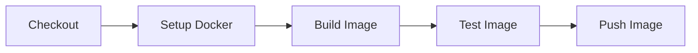

# Docker Build Pipeline

This example demonstrates building a Docker container image.

## Prerequisites

- Docker installed and running
- PDK installed

## Pipeline Overview



## The Pipeline

**File:** `.github/workflows/docker.yml`

```yaml
name: Docker Build

on:
  push:
    branches: [main]
    tags: ['v*']
  pull_request:
    branches: [main]

jobs:
  build:
    runs-on: ubuntu-latest

    steps:
      - name: Checkout code
        uses: actions/checkout@v4

      - name: Set up Docker Buildx
        uses: docker/setup-buildx-action@v3

      - name: Build image
        run: |
          docker build -t myapp:${{ github.sha }} .

      - name: Test image
        run: |
          docker run --rm myapp:${{ github.sha }} --version

      - name: Tag image
        if: startsWith(github.ref, 'refs/tags/')
        run: |
          docker tag myapp:${{ github.sha }} myapp:latest
          docker tag myapp:${{ github.sha }} myapp:${{ github.ref_name }}
```

## Running with PDK

### Full Pipeline

```bash
pdk run --file .github/workflows/docker.yml
```

**Expected output:**

```
Pipeline: Docker Build
Runner: ubuntu-latest

Job: build
  Step: Checkout code
    Cloning repository...
  Step: Set up Docker Buildx
    Docker Buildx configured
  Step: Build image
    Building Docker image...
    Successfully built abc123
    Successfully tagged myapp:sha-xyz
  Step: Test image
    Running image test...
    myapp version 1.0.0

Pipeline completed successfully in 45.2s
```

### Development Workflow

```bash
# Build only, skip push
pdk run --skip-step "Tag image"

# Watch for changes and rebuild
pdk run --watch --step-filter "Build image"

# Verbose build output
pdk run --verbose
```

## Sample Dockerfile

```dockerfile
# Multi-stage build for .NET application
FROM mcr.microsoft.com/dotnet/sdk:8.0 AS build
WORKDIR /src
COPY *.csproj .
RUN dotnet restore
COPY . .
RUN dotnet publish -c Release -o /app

FROM mcr.microsoft.com/dotnet/aspnet:8.0
WORKDIR /app
COPY --from=build /app .
EXPOSE 8080
ENTRYPOINT ["dotnet", "MyApp.dll"]
```

## Customization

### Multi-Platform Build

```yaml
- name: Build multi-platform
  run: |
    docker buildx build \
      --platform linux/amd64,linux/arm64 \
      -t myapp:latest \
      .
```

### Build Arguments

```yaml
- name: Build with args
  run: |
    docker build \
      --build-arg VERSION=${{ github.ref_name }} \
      --build-arg BUILD_DATE=$(date -u +'%Y-%m-%dT%H:%M:%SZ') \
      -t myapp:latest \
      .
```

### Cache Layers

```yaml
- name: Build with cache
  run: |
    docker build \
      --cache-from=myapp:cache \
      --cache-to=type=inline \
      -t myapp:latest \
      .
```

### Push to Registry

```yaml
- name: Login to Registry
  run: echo "${{ secrets.REGISTRY_TOKEN }}" | docker login ghcr.io -u ${{ github.actor }} --password-stdin

- name: Push image
  run: |
    docker push ghcr.io/owner/myapp:latest
```

## Project Structure

```
docker-app/
├── .github/
│   └── workflows/
│       └── docker.yml
├── src/
│   └── Program.cs
├── Dockerfile
└── MyApp.csproj
```

## Common Issues

### "Cannot connect to Docker daemon"

Docker is not running. Start Docker Desktop or:

```bash
# Use host mode without Docker (won't build images)
pdk run --host
```

### Build context too large

Add a `.dockerignore` file:

```
node_modules/
.git/
*.log
```

### Image test fails

Check the container entrypoint and command:

```bash
docker run --rm -it myapp:latest /bin/sh
```

## See Also

- [.NET Publish Example](dotnet-publish.md)
- [Multi-Stage Pipeline](multi-stage.md)
- [Troubleshooting](../guides/troubleshooting.md)
