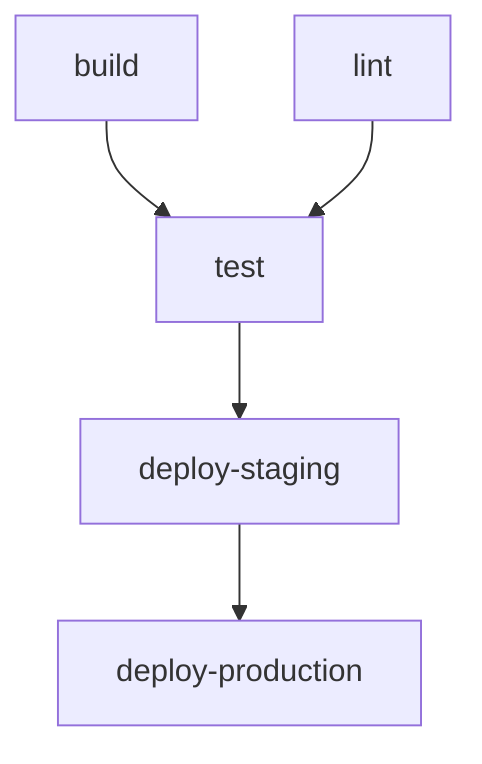

# Multi-Stage Pipeline

This example demonstrates a pipeline with multiple jobs and dependencies.

## Prerequisites

- .NET 8.0 SDK
- Node.js 18+
- Docker
- PDK installed

## Pipeline Overview



## The Pipeline

**File:** `.github/workflows/ci-cd.yml`

```yaml
name: CI/CD Pipeline

on:
  push:
    branches: [main]
  pull_request:
    branches: [main]

jobs:
  build:
    runs-on: ubuntu-latest
    steps:
      - name: Checkout
        uses: actions/checkout@v4

      - name: Setup .NET
        uses: actions/setup-dotnet@v4
        with:
          dotnet-version: '8.0.x'

      - name: Restore
        run: dotnet restore

      - name: Build
        run: dotnet build --no-restore --configuration Release

      - name: Publish
        run: dotnet publish --no-build --configuration Release --output ./publish

      - name: Upload build artifacts
        uses: actions/upload-artifact@v4
        with:
          name: app-build
          path: ./publish

  lint:
    runs-on: ubuntu-latest
    steps:
      - name: Checkout
        uses: actions/checkout@v4

      - name: Setup Node.js
        uses: actions/setup-node@v4
        with:
          node-version: '18'

      - name: Install dependencies
        run: npm ci

      - name: Run linter
        run: npm run lint

  test:
    needs: [build, lint]
    runs-on: ubuntu-latest
    steps:
      - name: Checkout
        uses: actions/checkout@v4

      - name: Setup .NET
        uses: actions/setup-dotnet@v4
        with:
          dotnet-version: '8.0.x'

      - name: Restore
        run: dotnet restore

      - name: Unit Tests
        run: dotnet test --configuration Release --verbosity normal

      - name: Download build artifacts
        uses: actions/download-artifact@v4
        with:
          name: app-build
          path: ./app

      - name: Integration Tests
        run: |
          cd ./app
          dotnet MyApp.dll --run-integration-tests

  deploy-staging:
    needs: test
    runs-on: ubuntu-latest
    if: github.ref == 'refs/heads/main'
    environment: staging
    steps:
      - name: Download artifacts
        uses: actions/download-artifact@v4
        with:
          name: app-build
          path: ./app

      - name: Deploy to Staging
        run: |
          echo "Deploying to staging..."
          # ./deploy.sh staging

  deploy-production:
    needs: deploy-staging
    runs-on: ubuntu-latest
    if: github.ref == 'refs/heads/main'
    environment: production
    steps:
      - name: Download artifacts
        uses: actions/download-artifact@v4
        with:
          name: app-build
          path: ./app

      - name: Deploy to Production
        run: |
          echo "Deploying to production..."
          # ./deploy.sh production
```

## Running with PDK

### Full Pipeline

```bash
pdk run --file .github/workflows/ci-cd.yml
```

### Run Specific Jobs

```bash
# Run only build job
pdk run --job build

# Run build and test
pdk run --job build --job test

# Skip deployment jobs
pdk run --skip-step "Deploy to Staging" --skip-step "Deploy to Production"
```

### Development Workflow

```bash
# Focus on build during development
pdk run --job build --watch

# Run lint and build in parallel (if supported)
pdk run --job build --job lint

# Skip slow jobs
pdk run --skip-step "Integration Tests"
```

### Preview Dependencies

```bash
# See execution plan
pdk run --dry-run --verbose
```

Output shows job dependencies:

```
Execution Plan
==============

Job: build (order: 1)
  - Checkout, Setup .NET, Restore, Build, Publish

Job: lint (order: 1, parallel with: build)
  - Checkout, Setup Node.js, Install, Run linter

Job: test (order: 2, needs: build, lint)
  - Unit Tests, Integration Tests

Job: deploy-staging (order: 3, needs: test)
  - Deploy to Staging

Job: deploy-production (order: 4, needs: deploy-staging)
  - Deploy to Production
```

## Job Dependencies

### Parallel Jobs

Jobs without `needs` run in parallel:

```yaml
jobs:
  build:
    # Runs immediately
  lint:
    # Runs in parallel with build
```

### Sequential Jobs

Use `needs` to create dependencies:

```yaml
test:
  needs: [build, lint]  # Waits for both
```

### Conditional Jobs

Use `if` to control when jobs run:

```yaml
deploy:
  if: github.ref == 'refs/heads/main'
```

## Customization

### Add More Stages

```yaml
security-scan:
  needs: build
  steps:
    - name: Security Scan
      run: npm audit

qa-tests:
  needs: [test, security-scan]
  steps:
    - name: QA Tests
      run: npm run test:qa
```

### Matrix Strategy

```yaml
test:
  strategy:
    matrix:
      os: [ubuntu-latest, windows-latest]
      dotnet: ['6.0', '8.0']
  runs-on: ${{ matrix.os }}
```

## Project Structure

```
multi-stage/
├── .github/
│   └── workflows/
│       └── ci-cd.yml
├── src/
│   └── MyApp/
├── tests/
│   └── MyApp.Tests/
├── frontend/
│   ├── package.json
│   └── src/
└── MyApp.sln
```

## Common Issues

### Jobs run out of order

Check `needs` declarations. Jobs without dependencies run in parallel.

### Artifacts not found

Ensure upload and download artifact names match:

```yaml
# Upload
- uses: actions/upload-artifact@v4
  with:
    name: app-build  # Must match

# Download
- uses: actions/download-artifact@v4
  with:
    name: app-build  # Must match
```

## See Also

- [.NET Build Example](dotnet-build.md)
- [Artifacts Example](artifacts.md)
- [Step Filtering](../configuration/filtering.md)
