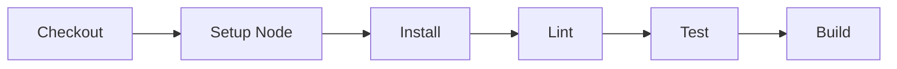

# Node.js Application Pipeline

This example demonstrates a Node.js application build and test pipeline.

## Prerequisites

- Node.js 18+ (for host mode)
- PDK installed
- Docker (optional)

## Pipeline Overview



## The Pipeline

**File:** `.github/workflows/ci.yml`

```yaml
name: Node.js CI

on:
  push:
    branches: [main]
  pull_request:
    branches: [main]

jobs:
  build:
    runs-on: ubuntu-latest

    steps:
      - name: Checkout code
        uses: actions/checkout@v4

      - name: Setup Node.js
        uses: actions/setup-node@v4
        with:
          node-version: '18'
          cache: 'npm'

      - name: Install dependencies
        run: npm ci

      - name: Lint
        run: npm run lint

      - name: Test
        run: npm test

      - name: Build
        run: npm run build
```

## Running with PDK

### Full Pipeline

```bash
pdk run --file .github/workflows/ci.yml
```

**Expected output:**

```
Pipeline: Node.js CI
Runner: ubuntu-latest

Job: build
  Step: Checkout code
    Cloning repository...
  Step: Setup Node.js
    Node.js 18.x installed
  Step: Install dependencies
    Installing packages...
    added 342 packages in 8.2s
  Step: Lint
    Running ESLint...
    No errors found
  Step: Test
    Running Jest...
    Tests: 15 passed, 0 failed
  Step: Build
    Building application...
    Build completed

Pipeline completed successfully in 22.4s
```

### Development Workflow

```bash
# Watch mode for rapid development
pdk run --watch --step-filter "Build"

# Skip slow tests
pdk run --skip-step "Test"

# Run lint and test only
pdk run --step-filter "Lint" --step-filter "Test"
```

## Customization

### Different Node Version

```yaml
- name: Setup Node.js
  uses: actions/setup-node@v4
  with:
    node-version: '20'
```

### With npm Audit

```yaml
- name: Security Audit
  run: npm audit --production
```

### Type Checking (TypeScript)

```yaml
- name: Type Check
  run: npm run typecheck
```

### E2E Tests

```yaml
- name: E2E Tests
  run: npm run test:e2e
```

## Project Structure

```
nodejs-app/
├── .github/
│   └── workflows/
│       └── ci.yml
├── src/
│   ├── index.js
│   └── utils/
├── tests/
│   └── index.test.js
├── package.json
└── package-lock.json
```

## Sample package.json

```json
{
  "name": "nodejs-app",
  "version": "1.0.0",
  "scripts": {
    "build": "node build.js",
    "test": "jest",
    "lint": "eslint src/",
    "typecheck": "tsc --noEmit"
  },
  "devDependencies": {
    "jest": "^29.0.0",
    "eslint": "^8.0.0"
  }
}
```

## Common Issues

### "npm: command not found" (Host Mode)

Install Node.js locally or use Docker mode:

```bash
pdk run --docker
```

### Slow npm install

Use npm ci instead of npm install for faster, reproducible installs:

```yaml
- name: Install
  run: npm ci
```

### Cache Issues

Clear npm cache:

```bash
npm cache clean --force
```

## See Also

- [Docker Build Example](docker-build.md)
- [Multi-Stage Pipeline](multi-stage.md)
- [Watch Mode](../configuration/watch-mode.md)
