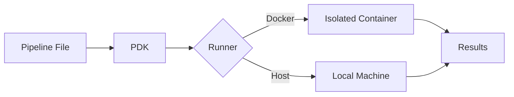

# PDK Documentation

PDK (Pipeline Development Kit) is a command-line tool that lets you run CI/CD pipelines locally before pushing to remote repositories. Test your GitHub Actions and Azure DevOps pipelines on your machine, catch errors early, and iterate faster.

## Why PDK?

- **Catch errors early**: Validate pipeline syntax and test execution locally
- **Faster feedback**: No more waiting for remote CI/CD runs to find issues
- **Cost savings**: Reduce wasted CI/CD minutes from failed builds
- **Offline development**: Test pipelines without internet access

## Quick Links

### Getting Started
- [Quick Start Guide](getting-started.md) - Run your first pipeline in under 5 minutes
- [Installation](installation.md) - Detailed installation instructions

### Reference
- [Command Reference](commands/README.md) - All PDK commands and options
- [Configuration](configuration/README.md) - Configure PDK behavior

### Guides
- [Troubleshooting](guides/troubleshooting.md) - Common issues and solutions
- [Best Practices](guides/best-practices.md) - Tips for effective pipeline development
- [CI/CD Integration](guides/cicd-integration.md) - Use PDK in your CI/CD pipelines

### Examples
- [Example Overview](examples/README.md) - Working pipeline examples
- [.NET Projects](examples/dotnet-build.md) - Build and test .NET applications
- [Node.js Projects](examples/nodejs-app.md) - Node.js pipeline examples
- [Docker Builds](examples/docker-build.md) - Container build pipelines

## Supported Pipeline Formats

PDK supports the following CI/CD pipeline formats:

| Format | Status | File Patterns |
|--------|--------|---------------|
| GitHub Actions | Supported | `.github/workflows/*.yml` |
| Azure DevOps | Supported | `azure-pipelines.yml` |

## Features at a Glance

### Core Features
- **Multiple Runners**: Execute in Docker containers or directly on your host machine
- **Watch Mode**: Automatically re-run pipelines when files change
- **Dry-Run Mode**: Validate and preview execution without running steps
- **Step Filtering**: Run specific steps or ranges for focused testing

### Advanced Features
- **Structured Logging**: Debug with correlation IDs and JSON output
- **Secret Management**: Securely store and use secrets locally
- **Configuration Files**: Share settings across projects
- **Performance Options**: Container reuse, image caching, parallel execution

## System Requirements

- **.NET 8.0 SDK** or later
- **Docker** (optional but recommended for isolated execution)
- **Windows**, **macOS**, or **Linux**

## Next Steps

Ready to get started? Head to the [Quick Start Guide](getting-started.md) to run your first pipeline in under 5 minutes.
