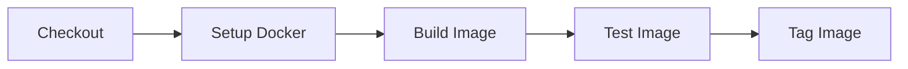

# Docker Application Example

A .NET application with Docker containerization demonstrating a CI pipeline with PDK.

## Quick Start

```bash
# Run the pipeline
pdk run

# Run specific steps
pdk run --step-filter "Build image"

# Skip push during development
pdk run --skip-step "Push image"
```

## Project Structure

```
docker-app/
├── .github/
│   └── workflows/
│       └── ci.yml          # GitHub Actions workflow
├── src/
│   ├── Program.cs          # Main application
│   └── DockerApp.csproj    # Project file
├── Dockerfile              # Container definition
└── README.md
```

## Pipeline Stages



## Running the Example

### Full Pipeline

```bash
cd examples/docker-app
pdk run --file .github/workflows/ci.yml
```

### Development Mode

```bash
# Watch for changes and rebuild
pdk run --watch --step-filter "Build image"

# Skip tagging
pdk run --skip-step "Tag image"
```

### Validation

```bash
# Dry-run to validate pipeline
pdk run --dry-run --verbose
```

## Requirements

- Docker installed and running
- .NET 8.0 SDK (for local development)
- PDK installed

## Docker Image

The application is built as a multi-stage Docker image:

1. **Build stage**: Uses .NET SDK to build the application
2. **Runtime stage**: Uses .NET ASP.NET runtime for smaller image size

## Building Locally

```bash
# Build the Docker image
docker build -t docker-app:latest .

# Run the container
docker run -p 8080:8080 docker-app:latest

# Test the endpoint
curl http://localhost:8080/health
```

## See Also

- [Docker Build Example Docs](../../docs/examples/docker-build.md)
- [Getting Started Guide](../../docs/getting-started.md)
