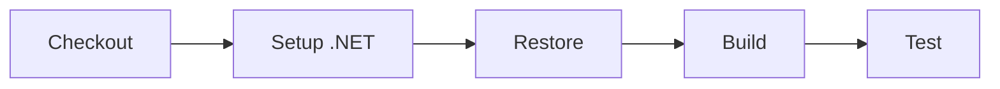

# .NET Console Application Example

A simple .NET console application demonstrating a basic CI pipeline with PDK.

## Quick Start

```bash
# Run the pipeline
pdk run

# Run specific steps
pdk run --step-filter "Build" --step-filter "Test"

# Watch mode for development
pdk run --watch --step-filter "Build"
```

## Project Structure

```
dotnet-console/
├── .github/
│   └── workflows/
│       └── ci.yml          # GitHub Actions workflow
├── src/
│   ├── Program.cs          # Main application
│   └── DotNetConsole.csproj # Project file
├── tests/
│   ├── ProgramTests.cs     # Unit tests
│   └── DotNetConsole.Tests.csproj
└── README.md
```

## Pipeline Stages



## Running the Example

### Full Pipeline

```bash
cd examples/dotnet-console
pdk run --file .github/workflows/ci.yml
```

### Development Mode

```bash
# Watch for changes and rebuild
pdk run --watch --step-filter "Build"

# Skip tests for faster iteration
pdk run --skip-step "Test"
```

## Requirements

- .NET 8.0 SDK
- Docker (optional)
- PDK installed

## Application

The console application demonstrates:
- Command-line argument parsing
- Simple calculator operations
- Exit codes

## See Also

- [.NET Build Example Docs](../../docs/examples/dotnet-build.md)
- [Getting Started Guide](../../docs/getting-started.md)
