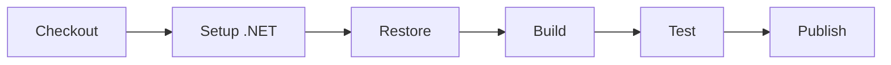

# .NET Web API Example

A simple ASP.NET Core Web API project demonstrating a complete CI pipeline with PDK.

## Quick Start

```bash
# Run the pipeline
pdk run

# Run specific steps
pdk run --step-filter "Build" --step-filter "Test"

# Watch mode for development
pdk run --watch --step-filter "Build"
```

## Project Structure

```
dotnet-webapi/
├── .github/
│   └── workflows/
│       └── ci.yml          # GitHub Actions workflow
├── src/
│   ├── Program.cs          # Application entry point
│   ├── WeatherForecast.cs  # Model class
│   └── WebApi.csproj       # Project file
├── tests/
│   ├── WeatherTests.cs     # Unit tests
│   └── WebApi.Tests.csproj # Test project file
└── README.md
```

## Pipeline Stages



## Running the Example

### Full Pipeline

```bash
cd examples/dotnet-webapi
pdk run --file .github/workflows/ci.yml
```

### Development Mode

```bash
# Watch for changes and rebuild
pdk run --watch --step-filter "Build"

# Skip tests for faster iteration
pdk run --skip-step "Test"
```

### Validation

```bash
# Dry-run to validate pipeline
pdk run --dry-run --verbose
```

## Requirements

- .NET 8.0 SDK
- Docker (optional, for container execution)
- PDK installed

## Customization

### Different .NET Version

Edit the workflow to use a different .NET version:

```yaml
- name: Setup .NET
  uses: actions/setup-dotnet@v4
  with:
    dotnet-version: '9.0.x'
```

### Add Code Coverage

```yaml
- name: Test with Coverage
  run: dotnet test --collect:"XPlat Code Coverage"
```

## API Endpoints

When running, the API provides:

- `GET /weatherforecast` - Returns weather forecast data

## See Also

- [.NET Build Example](../../docs/examples/dotnet-build.md)
- [Getting Started Guide](../../docs/getting-started.md)
